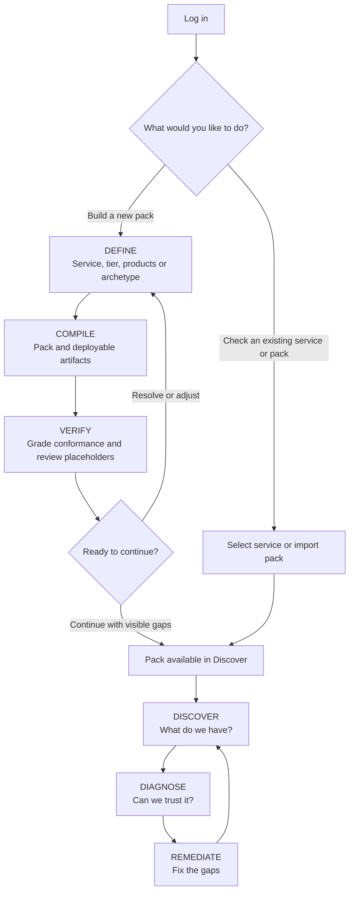

# The BUILD journey

A second, parallel journey beside Discover · Diagnose · Remediate, for teams that
have no pack yet. Three steps in the same visual language, ending where the
existing journey begins. This document is the contract between the engine
(slice 1, shipped: `tools/lib/library.mjs`, `library/`, `packc init`) and the
studio + API built on top of it (slice 2, shipped: `/api/library/*`, `BUILD_TABS`,
`studio/build-*.mjs` — see "Slice 2" below). Precedent, superseded by this
design: [archive/COMPOSE_MODE_PLAN.md](archive/COMPOSE_MODE_PLAN.md) (drag-and-drop
authoring from a block library — the library is now data, the canvas is the
generated pack) and [archive/REFERENCE_CATALOGUE_PLAN.md](archive/REFERENCE_CATALOGUE_PLAN.md)
(the catalogue those blocks came from — the reference packs are now the evidence
behind the entries).

## Where it starts

The first decision is about the pack, because a service may already exist without
one. Both landings — the signed-in service gate and the local hero — open with one
question: **Do you want to check an existing service or pack, or build a new pack?**
The first answer leads to the service picker or an import (upload, repo scan, live
MCP draft); the second to DEFINE. The two paths join at *Pack available in Discover*:
a newly compiled pack enters the same audit journey as an imported one, and its
unresolved placeholders stay visible so Diagnose grades them as gaps, never as verified.



## The three steps

| Step | Question | Input | Output |
|---|---|---|---|
| 1 DEFINE | What are we observing? | service name, owners, criticality tier-1/2/3, environment, one or more library entries (products it runs on, or an archetype for a service built from scratch) | the entries' params with defaults; the tier's requirements (`tierRequirements`) |
| 2 COMPILE | What should we watch? | per-entry SLI toggles (filtered by tier), params, section toggles (SLOs, policy + routes, dashboards, validation) | the canonical pack + todos + provenance (`instantiatePack`) |
| 3 VERIFY | Is it ready to use? | the pack | which clauses pass, which pass only on a placeholder, which fail (`validationSummary`); the schema verdict; the compiled artifacts through the existing targets (Prometheus rules, OTel Collector, Alertmanager, Grafana dashboards) |

**Hand-off.** VERIFY ends on *Ready to continue?* with two exits: *Resolve or adjust*
returns to DEFINE; *Continue with visible gaps* (*Continue to Discover* when no
placeholder remains) registers the produced pack in the studio's upload registry (the
same path an uploaded pack takes) and switches to the existing journey:
Discover shows its layers, Diagnose compares it with a live pack, Remediate compiles
and deploys the delta. Nothing in Discover / Diagnose / Remediate changes; a
library-built pack is an ordinary canonical pack with provenance annotations.

## The library

`library/products/<product>.library.yaml` and `library/archetypes/<archetype>.library.yaml`,
format `library: v1`, one entry per product or archetype, each a parameterised pack
fragment. The annotated example and the field list are in
[library/README.md](../library/README.md); the shape in one breath:

```
id · kind (product | archetype) · version · title · product · summary · description · tags · derivedFrom
evidence { status, verifiedOn, sources[], notes, gaps[] }
params[] { id, label, default, description, placeholder? }
otel { languages[], custom_attributes[] }
telemetry { scrape_jobs[] { job_name, scrape_interval, targets[], minTier }, receivers[] }
slis[] { id, type, minTier, description, why, unit, metrics[], evidence { status, source },
         good/total | query/threshold, slo { objective per tier, window per tier }, burn,
         forecast?, chaos?, remediation? { runbook, automation, guardrails, minTier — no trigger: derived } }
views[] · dashboards[] { id, minTier, binds[] } · synthetic[] { …, minTier }
```

Entries shipped in slice 1 and their evidence status:

| Entry | Kind | Evidence | Derived from |
|---|---|---|---|
| kafka, prometheus, grafana | product | recorded-live (2026-09-22) | the reference packs + `docs/catalogue-evidence/*.md` "Measured live" |
| ibm-mq | product | recorded-live (2026-09-16, certified) | mq-observability-pack `packs/ibmmq.pack.yaml` + its evidence docs (read-only) |
| alertmanager, otel-collector | product | recorded-live (2026-09-07) | `tools/lib/contracts/stack-self-metrics.mjs` (pinned stack exposition + PromQL) |
| loki, tempo | product | recorded-live (2026-09-07) | `up` of the lab's scrape job + the collector / promtail rows of the alias table; no `loki_*` / `tempo_*` request metric is in the evidence, so none is named (`evidence.gaps`) |
| http-service, queue-consumer | archetype | semconv (v1.27.0, Prometheus spelling; not verified live in this repo, and the entry says so) | OTel semantic conventions + the Prometheus compatibility naming rules |

## The tier scaffold

One function, `tierScaffold`, shared by every entry. It produces the structural
sections and grows them with the tier so that every MUST clause of
`tools/lib/conformance.mjs` that applies at the tier is satisfied when every toggle
is on — the rubric is the only definition of a tier; `tierRequirements(tier)` is that
rubric filtered by `minTier`.

| Section | tier-3 | tier-2 adds | tier-1 adds |
|---|---|---|---|
| otel | semconv 1.27.0, `service.name` + `deployment.environment`, head sampling 0.1 | `service.namespace`, `service.version`, `log_correlation: true` | `service.instance.id` (5 attrs), head ratio 1.0 (tail sampling decides) |
| telemetry.backends | Prometheus + Loki + Tempo, `gating: warn`; the declared versions are placeholder params (`prometheus_version`, `loki_version`, `tempo_version`), `min` the scaffold floor | — | `gating: enforce` |
| pipelines | otlp receiver, prometheus receiver with the entries' scrape jobs, memory_limiter + batch, three exporters (prometheusremotewrite, otlphttp → Loki, otlp → Tempo) | resource processor | tail_sampling processor |
| storage | 15d / 7d / 3d, head-based | 90d / 30d / 7d | 13mo / 90d / 14d, tail-based |
| queries | one `ref:slis.<id>` recording rule per SLI (`<svc>:<sli>:ratio_5m` / `value_5m`, the compiler's own names, deduplicated by it) + the entries' views | golden-signals view | — |
| dashboards | `<svc>-overview` (every SLI and SLO) + the entries' boards | `<svc>-slo-burn` (burn template, every SLO) | `<svc>-deployment-overlay` (SLIs), `<svc>-customer-impact` (SLOs) |
| policy | two-window burn alerts per SLO from the SLI's profile (availability / latency / saturation / slow), severities demoted one step | severities as declared | forecast on an availability SLO |
| alerting | SEV1/SEV2 → chat, SEV3 → team chat, dedup | SEV1 voice, suppress contexts | SEV2 voice |
| remediation | — | the entries' templates, each triggered by its SLI's fast burn alert under the compiler's name (`alert:<slo>_burn_<factor>x_<short>_<long>`): the alerts a library pack compiles, so the trigger resolves like a chaos `expected_alert` does | a generic manual-only one on the first SLO when the entries have none |
| baselines | tier defaults | + p95 targets, `warn_only` | `block_release_if_either_breaches_target` |
| validation | the entries' probes (or a fallback blackbox probe) | the entries' chaos experiments, monthly in staging (a generic one when none) | one experiment per SLO, the first one again weekly in prod, the first probe `otel_instrumentation: true` |

Severities, windows and factors are the reference packs' (`BURN_PROFILES`); the
retention and baseline numbers are starting points and are reported as todos.

## Toggles and honest gaps

`defaultToggles(entry, tier)` → `{ slis: [ids whose minTier the tier reaches], slos,
policy, routes, dashboards, validation }`, every section on. A section switched off is
**absent** from the pack. The schema then reports the missing required key or the
`minItems: 1` floor (`validateCanonical`), and the rubric reports the clauses the
section satisfied (`evaluateConformance`) — VERIFY shows both, nothing is faked to
keep a clause green. `slos: false` also drops policy (an SLO-less burn alert is
meaningless); `policy: false` keeps the SLOs and drops the burn alerts and forecasts.

## Placeholders and provenance

**Placeholders** are the values the library cannot know. Every one is a parameter
flagged `placeholder: true` (the scaffold's: `oncall_channel`, `team_channel`,
`pager_service`, `pager_service_low`, `metrics_endpoint`, `remote_write_url`,
`logs_endpoint`, `logs_otlp_endpoint`, `traces_endpoint`, `traces_otlp_endpoint`,
`chaos_target`, `probe_target`, and the backend versions the pack declares —
`prometheus_version`, `loki_version`, `tempo_version` (`version.declared` on each
backend and `storage.<signal>.version`; `min` stays the scaffold's floor 2.53 / 3.0 / 2.5,
what the wiring and the PromQL are known to work from, and tier-1 enforces the block);
the entries': scrape targets, bootstrap addresses,
workloads, canary queues). Left at its default it is written into the pack as a
plausible value **and** reported as a todo at the artefact where it landed, plus the
scaffold's own todos (an unwritten runbook, baseline targets, a generic chaos fault,
defaulted owners). The annotation mirrors the crawler's stub marker
(`crawler.scaffold.<symbol>` → `library.todo.<symbol>`, the symbol being the adapter's
artefact id: `alerting.routes[0]`, `validation.synthetic_checks.<id>`,
`telemetry.backends.<id>`, `pipelines.exporters.metrics`, `remediation[0]`, `baselines`)
and `tools/lib/adapter.mjs` lists `library.todo.` beside `crawler.scaffold.` and
`mcp.scaffold.` in its scaffold prefixes, so the studio parks a placeholder artefact
as *Scaffold* — excluded from drift badness, never "declared and unverified" — exactly
as it parks a crawler stub. The todo list returned by the engine is the same
information structured: `{ path, fields, what, clause, clauses, params }` (one per
artefact, its placeholder fields listed), where
`clauses` names the conformance clauses the placeholder artefact holds up, so
VERIFY can say "passes, on a placeholder".

**A placeholder-laden pack is reported conformant.** `tools/lib/conformance.mjs` reads
no annotations, so a pager route of `pagerduty://<svc>`, a generic pod-failure chaos
experiment or an unwritten runbook satisfy their clauses like real ones: a kafka tier-2
pack with its todos untouched scores `MUST 15/15` through `POST /api/validate` and
`GET /api/packs/<id>/conformance` with no key that mentions a placeholder, and at tier-1
10 of the 25 MUST clauses pass on one. That is exactly how a crawler stub behaves today
(aligned on purpose: the placeholder is parked as *Scaffold*, never graded as declared and
unverified), and only `validationSummary(canonical, todos).onPlaceholder` — what
`packc init` prints as "N clause(s) pass on a placeholder" — tells the two apart. Slice 2
must carry it, not rediscover it: the VERIFY step shows a third state, *pass
(placeholder)*, for those clauses; the register hand-off keeps the todos with the pack
(they are already in `metadata.annotations`, so nothing is lost); `/api/validate` attaches
`onPlaceholder` whenever `library.todo.*` annotations exist. A pack whose placeholders
were never filled is conformant on paper and pages nobody.

**Provenance**: `metadata.annotations['library.source'] = '<entry id>@<entry version>'`
(comma-joined when composed), `library.format`, `library.tier`, `library.environment`,
`library.toggles`, `library.slis`, `library.params` (the overrides), `library.evidence`
and `library.evidence.slis.<id>` (per-SLI status and source), `library.todoCount`,
`library.todo.<symbol>`; `metadata.labels.source = library`. Diff can tell
library-derived from hand-written; a later library release compares
`library.source` with its own version to propose an upgrade (slice 3).

## The evidence bar for entries

`evidence.status` per entry and per SLI: `recorded-live` (the name was read from a
product's own exposition and the expression executed — the reference packs' "Measured
live" sections, the MQ certification, the pinned docker stack of the alias table),
`reference-pack` (taken from a reference pack whose evidence is documentary),
`upstream-docs` (the product's documentation only), `semconv` (a named OpenTelemetry
semantic-conventions version, Prometheus spelling by the compatibility rules). No
metric name is invented: `validateLibraryEntry` checks that every name in
`slis[].metrics` appears in the query, and the library README's quality bar says where
a name may come from. Where a spelling could not be verified in this repository the
entry says so; where a product has no evidence-backed metric for a signal, the SLI
is absent and `evidence.gaps` says why (loki, tempo, alertmanager and otel-collector
have no latency SLI; their tier-2 threshold SLIs are failure / drop rates and say so).

## The engine API (`tools/lib/library.mjs`, pure, browser-safe, served at `/lib`)

```
parseLibraryEntry(textOrObject)                 → entry            (mini-yaml when given text)
validateLibraryEntry(entry)                     → errors: string[] ([] when sound)
libraryIndex(entries)                           → [{ id, kind, title, product, version, summary, tags,
                                                     evidence { status, verifiedOn, sources[], gaps[] },
                                                     params[], slis[] { id, type, minTier, evidence, metrics, objectives, windows },
                                                     sliCountByTier, tiers }]
tierRequirements(tier)                          → the conformance clauses that apply at the tier
                                                  ({ id, dimension, severity, minTier, description, specRef })
defaultToggles(entryOrEntries, tier)            → { slis: [ids], slos, policy, routes, dashboards, validation }
instantiatePack(entryOrEntries, { name, tier, environment, owners, params, toggles, promql })
                                                → { canonical, todos: [{ path, fields, what, clause, clauses, params }],
                                                    provenance: { entry, version, entries, source, tier, environment,
                                                                  toggles, params, placeholders },
                                                    warnings: [{ kind, message, sli?, field? }] }
tierScaffold({ tier, service, environment, owners, fragments, toggles })
                                                → { canonical (with ${param} placeholders), todos }   (the one scaffold)
validationSummary(canonical, todos)             → { tier, conformant, must, should, passing[], onPlaceholder[], failing[] }
todosFromAnnotations(canonical)                 → the todo list rebuilt from the pack's library.todo.* annotations
                                                  (clauses derived from the pack; what /api/validate and the register
                                                  hand-off feed validationSummary with)
hasLibraryTodos(canonical)                      → whether a pack carries library.todo.* annotations
symbolOf(path, root)                            → { symbol, field }   (the adapter's artefact id for a pack path)
sloIdFor(sliId, objective)                      → '<sli>_<pct>'        (broker_availability, 0.999 → broker_availability_99_9:
                                                                        the SLO id of an SLI, derived here, never re-implemented)
constants: LIBRARY_FORMAT ('v1'), TIERS, ENTRY_KINDS, EVIDENCE_STATUSES, SLI_TYPES, SLO_WINDOWS, SECTION_TOGGLES,
           BURN_PROFILES, SCAFFOLD_PARAMS, SEMCONV_VERSION, MAX_PARAM_LENGTH (4096)
```

`instantiatePack` throws on a usage error (unknown tier, an unknown SLI, no entry, a
param key that is not a parameter of the instantiation, a param value that is not a
string, number or boolean) and never on an entry that validates. A mistyped param is
never dropped silently: the error lists the known keys. A selected SLI whose `minTier`
the tier does not reach is **excluded, not fatal**: it comes back as a `warnings` entry
of kind `sli-excluded` and the rest of the selection builds (the tier changes after the
SLIs were ticked, DEFINE then COMPILE); only a selection with nothing left throws.

**Params and PromQL.** A param value is spliced verbatim into label matchers, scrape
targets and endpoints, so a string carrying a double quote, a backslash or a control
character is refused (a usage error; `--param 'broker_job=brokers"}'` once produced
`up{job="brokers"}"} == bool 1` in a pack that validated and passed every MUST), and so is
a value longer than `MAX_PARAM_LENGTH` (4096 characters: a 3 MB value was once accepted and
spliced into a 9 MB pack); the unknown-key error echoes at most ten of the unknown keys
(200,000 bogus keys once made a 1.7 MB error). A value error reads `param <key>: …`, so a
caller can point at the field. Every
resolved SLI expression is then parsed with the parser given as `promql`: `packc init`
passes the Lezer grammar (`tools/lib/promql-lezer.mjs`, an npm import, Node-only) and a
failure is a `warnings` entry of kind `promql`, which makes the CLI exit 1. The
browser-safe core (`tools/lib/promql.mjs`) extracts dependencies and reports no grammar
error, so a caller with no parser gets no `promql` warning: the studio (slice 2) runs the
instantiation through the API, where Node passes the grammar. `warnings` is what COMPILE
shows beside the todos; its kinds: `promql` (the pack must not ship), `sli-excluded` (an
SLI above the tier was dropped), `burn-rules` (the burn-rule generator's own warnings on
the produced policy — `tools/lib/burn-rules.mjs` compiled once at build time, so a
subtracted good leg without a presence guard or a ratio-unit threshold it reads as an
upper bound is seen when the pack is made, not when its alerts stay silent; the shipped
entries draw none of the guardable ones, the suite checks). Several entries compose
into one pack: ids are prefixed with the entry id (`kafka_broker_availability`,
`http-service-…` boards), entry params are addressed as `<entry>.<param>` (a bare
`<param>` reaches every entry that declares it), the scaffold sections are shared.

Node side, `server/library.mjs`: `loadLibrary({ root })` → `{ root, entries, errors }`
(reads `library/**/*.library.yaml`, parses and validates each, drops duplicates; a root
that is not a directory is one error on the root itself, never an empty library, so an
install without `library/` says why every entry is unknown), `findEntry`,
`listLibraryFiles`, `defaultLibraryRoot`. `library/` ships in the npm package (`files`)
beside `server/` and `tools/`. Nothing under `tools/lib` touches the filesystem.

## The CLI

```
packc init --list                                   the entries table
packc init --show <entry>                           params (entry + scaffold), SLIs per tier, objectives, evidence
packc init --entry <id>[,<id>] --tier tier-2 --name <svc> [--env <env>] [--owner <team>]...
           [--param k=v]... [--slis a,b] [--no-slos|--no-policy|--no-routes|--no-dashboards|--no-validation]
           [--out <file>] [--json] [--library <dir>]
```

YAML to stdout (or `--out`), the todo list, the warnings and the conformance line to
stderr; exit `0` ok, `1` the produced pack does not validate against the v1.2 schema (a
section toggled off), fails a MUST clause of its tier (a `--slis` selection with no
latency SLO at tier-2: `packc journey`'s "gate failed", so a CI caller can tell `MUST
14/15` from `15/15`), an SLI is not valid PromQL once the `--param` values are in, or an
entry fails validation, `2` usage error (an unknown `--param` key or a value carrying a
quote is one) — the convention of `tools/validate-pack.mjs` and `packc journey`.

## Slice 2 — the studio journey and the API (shipped)

**The API** (`server/index.mjs`, registered after the write-route auth and tenancy
middleware, so the routes carry the posture of `POST /api/validate` and `POST /api/crawl`:
open in local mode, a session + CSRF header or a bearer in identity mode; the library is
read from disk once per process):

| Route | Contract |
|---|---|
| `GET /api/library` | `{ ok, entries: libraryIndex(loadLibrary().entries), scaffoldParams: SCAFFOLD_PARAMS, errors }` — the scaffold params ride along because every instantiation has them and DEFINE lists the selection's full parameter table |
| `GET /api/library/requirements/:tier` | `{ ok, tier, clauses: tierRequirements(tier) }`; 400 naming the known tiers |
| `GET /api/library/:id` | `{ ok, entry: <index row>, params, scaffoldParams, slis (full templates: metrics, good/total or query/threshold, per-tier slo, burn, evidence, why, chaos, remediation), description, evidence, otel, telemetry }`; 404 naming the known entries |
| `POST /api/library/instantiate` | body `{ entries: [ids] \| id, name, tier, environment, owners, params, toggles }` → `{ ok, canonical, canonicalYaml, todos, provenance, warnings, schemaErrors (validateCanonical), summary (validationSummary), conformance (evaluateConformance of the env-overlaid canonical, exactly as /api/validate computes it), adapted (adapt of the env-overlaid canonical, exactly as /api/validate returns it — what Build's layer stack draws) }`; Node passes the Lezer grammar as `opts.promql` like `packc init`; an engine usage error is `400 { ok: false, errors }`, never 500 |
| `POST /api/library/compile` | body `{ canonical, target, dashboardId? }` → `{ ok, target, label, description, contentType, artifact: { filename, content, warnings, profile } }` through `compile.mjs`, nothing registered; 400 naming the known targets, 400 when the pack will not compile as toggled |
| `POST /api/library/register` | body `{ canonical, source? }` → `registerUploadedPack` exactly as /api/validate (source hint `library:<entries>@<tier>` when none given and the pack carries `library.source`; `metadata.name` otherwise, as /api/validate labels an upload) → `{ ok, registered: { id, source }, adapted, conformance, summary }`; a schema-invalid canonical is `400 { ok: false, errors }` |

`POST /api/validate` attaches `summary` (with `onPlaceholder`) whenever the canonical
carries `library.todo.*` annotations. That needed the todos to be recoverable from a
pack: `todosFromAnnotations(canonical)` (engine, new export) rebuilds `{ path, fields,
what, clause, clauses, params }` from the annotations, the clauses derived from the pack
itself (`clausesFor` learned the scaffold's one non-derivable clause, the tier-1 release
gate the baseline todo holds up; clause lists are sorted so both paths produce the same
list — verified for every entry at every tier and for a composed pack). `hasLibraryTodos`
says whether a pack carries any.

**The studio.** `state.mode === 'build'`; `BUILD_TABS` beside `OBSERVA_TABS` in
`studio/app.mjs` (the same `{ id, n, label, sub, techName, tagline, accent }` shape and the
same three accents), rendered by the one header renderer — the nav is rebuilt only when
the active set changes, a step card is reachable when the previous step's inputs are valid
(`buildStepReachability`), the current step is highlighted like today's active tab. DEFINE refuses a service name
longer than 45 characters once slugged (`MAX_SERVICE_SLUG`: the schema's 64-character Slug
minus the longest suffix the scaffold appends, tier-1's `-deployment-overlay` board id), so
a name that would fail the schema two steps later is stopped where it is typed. A usage
error from the engine (a param value it refuses, a selection with no SLI left) keeps the
previous pack on screen, marked stale, with the reason on the row that carries the value
(`param <key>: …` → the row on Select and under its todo on Validate); Validate stays
reachable and the hand-off is blocked until the value is fixed. Entry
points: a "Build a pack" card beside the hero's two, a "build a pack" action beside the
gate's "start something new", "Build from the library…" in the upload popover; the logo
returns home; an Advanced item or an analysis tab leaves build mode into the workspace.
Nothing in Discover / Diagnose / Remediate changed.

| Module | Role |
|---|---|
| `studio/build-model.mjs` | the pure models — `buildDefineModel`, `buildCompileModel`, `buildVerifyModel`, `buildClauseChecklist(clauses, summary)` (three states: `pass`, `placeholder`, `fail`; `pending` without a summary), `buildRailModel`, `buildStepReachability`, `clampStep`, `paramRows`, `groupTodos`, `instantiateBody`, `summarizeWarnings`; every input explicit, no state, no fetch |
| `studio/build-api.mjs` | the loaders — `loadLibrary`, `loadRequirements` (cached per tier), `loadEntry`, `loadTargets`, `instantiate`, `compilePreview`, `registerBuiltPack`; `fetchFn` injectable, a 4xx JSON body is an answer |
| `studio/build-define-view.mjs` | DEFINE (the silhouette) + the step head and the compilation-error note the three steps share |
| `studio/build-compile-view.mjs` | COMPILE (the live stack, the warnings, the YAML) |
| `studio/build-verify-view.mjs` | VERIFY and the hand-off |
| `studio/build-definition-view.mjs` | the definition column on every step ("The axis" below) |
| `studio/build-sheet-view.mjs` | the per-layer sheet ("The axis" below) |
| `studio/app.mjs` | the controller: `enterBuildMode`, the debounced, sequence-guarded re-instantiation on every change, the `host.build` actions the renderers call (never an import of app.mjs), `openInDiscover` |

`state.build` holds the draft (`name, owners, environment, tier, entries, params, slis,
toggles, result, preview, registeredId`) and survives a reload through the existing
persistence whitelist — inputs only (`BUILD_PERSIST_FIELDS`); the canonical is
re-instantiated on reload, never stored. Objectives and windows are shown read-only;
overriding an objective is a later slice.

**Deviations from the contract above, all additive.** `instantiate` also returns
`canonicalYaml` (the preview and the download without a browser YAML emitter) and
`conformance`; `GET /api/library` also returns `scaffoldParams`; `libraryIndex` rows carry
`windows` per tier beside `objectives` (COMPILE shows both); `POST /api/library/compile`
exists so VERIFY previews without registering; the studio does not import
`/lib/library.mjs` — the tier's clauses come from the requirements route (three tiny,
cached requests) and every instantiation goes through the API.

## The scan: Build renders the layer model

The studio's identity is the layer model. Discover draws every pack as L1 Contract ·
L2 Telemetry · L2X Extended · L3 Insight · L4 Action · L5 Validation · GOV — the layer
tokens `--L1…--GOV`, the artefact cards, the slab dashboard under Advanced → Discover.
Build, as shipped in slice 2, was forms plus a checklist rail: it produced a pack in that
language without ever showing it. From this slice on, **the centre stage of every Build
step is the layer stack of the pack being compiled**, drawn with the same artefact cards,
palette and tints as Discover, and the three steps are three states of one picture.

**Principles.** Nothing is invented:

- **The artefacts are the adapter's.** Build renders the instantiated pack through
  `tools/lib/adapter.mjs` `adapt(canonical, { environment })` — the projection Discover
  reads — and the same card markup (`.card`, `.card-head`, `.card-id`, `.card-source`,
  `.card-title`, `.card-desc`, `.card-foot`). `POST /api/library/instantiate` returns that
  projection as `adapted`, computed exactly as `POST /api/validate` computes it, so what
  Build shows on COMPILE is the artefact list Discover shows after the hand-off, id for id;
  the two journeys cannot drift. A placeholder artefact is *Scaffold* in both.
- **The silhouette is the rubric.** On DEFINE each slab carries one ghost card per clause
  that applies at the chosen tier in that dimension (`tierRequirements(tier)` grouped by
  `dimension`), so the tier is seen as the shape of the pack it demands, not read as a list;
  changing the tier reshapes it. The selected entries' SLI and SLO candidates land on L1 as
  ghost cards (id, type, objective and window at the tier, evidence badge), read-only —
  ticking stays on COMPILE.
- **The edge states are the checklist's.** Every slab's edge carries the rubric's verdict
  for its dimension, derived from `buildClauseChecklist` grouped by dimension: red when a
  clause fails, amber when the dimension holds up only on a placeholder, green when every
  clause passes on the pack as written, neutral when no clause applies (GOV), pending before
  the first result. A red edge names the clause and its description; a placeholder-laden
  pack shows *pass on a placeholder*, never plain green. A clause still unmet on COMPILE
  stays on its slab as a ghost card marked *Missing* — Discover's word for "required, not
  present".
- **The maturity bars are clause counts.** Per layer: pass, pass on a placeholder (its own
  segment) and fail, over the clauses of the dimension at the tier.
- **The todos live where their artefact lives.** On VERIFY each todo is pinned to the slab
  of the artefact it names — routes and runbooks on L4 (alerting, self-healing), backends,
  pipelines and storage on L2, probes, chaos and baselines on L5 — with the same inline
  parameter inputs as before; the pin is the todo's path family, and where the path is an
  adapter symbol the card it belongs to is marked.
- **Cause and effect in one glance.** A section switched off dims its slab and its clauses
  turn red on the edge; every re-instantiation re-renders the stack with the focused input
  kept focused.
- **The clause rail folds into the stack.** The per-layer clauses live on their slab (a
  click on the slab head expands them); the rail becomes a compact summary — the counts and
  the failing clauses — that expands to the full list on demand.

**Modules.** `studio/build-model.mjs` `buildStackModel({ adapted, checklist, requirements,
candidates, todos, params, mode, toggles, expanded })` → ordered slabs `[{ id, num, name,
state, clauses[], artefacts[], ghosts[], todos[], subgroups? (L4: policy · alerting ·
self-healing), counts, maturity, dimmed, offSections, expanded }]` (a slab's colour is its
layer token, `.section[data-layer]`, never a field of the model) — L2X only when it has an
artefact or a clause, GOV neutral, every input explicit, no state reads (tested under
`node:test` in `tools/test-build-model.mjs`, including that the artefact list is the one the
adapter gives Discover for the same canonical). `studio/build-stack-view.mjs`
`renderBuildStack(container, model, host)` draws it; the card's inner HTML is one shared
helper (`studio/card-html.mjs` `artefactCardHtml`) that Discover's `renderCard` and the stack
both call, so the markup is written once.

**Slices.**

1. **Foundation (this slice, shipped).** The stack on all three steps: DEFINE the
   silhouette (ghost per clause, L1 candidates from the entries, reshaping with the tier);
   COMPILE the live stack as the canvas (the SLI rows and the section toggles stay as the
   control area above it, the YAML as a collapsible below it), edges in the clause states,
   ghosts for unmet clauses, Scaffold for placeholders, a section off dims its slab; VERIFY
   the stack with the todos pinned to their slabs and the per-layer maturity bars on the
   verdict card, the artefacts strip and *Ready to continue?* unchanged; the compact rail;
   `adapted` on the instantiate response; light and dark themes.
2. **Layer detail (planned).** L1 SLO gauges (objective, window, burn profile per SLO);
   the L2 flow strip (instrumentation → receivers → processors → exporters → storage, drawn
   from the pipelines and the backends); L3 dashboard wireframes rendered from the compiled
   Grafana JSON; the L4 chain (policy → routing → remediation → guardrails); L5 cards for
   baselines, chaos and synthetics with their schedules and expected MTTD.
3. **The tomograph (planned).** The isometric slab stack with an acquisition animation —
   slabs lighting up as content arrives — and the landings' miniature stacks (a pack's
   silhouette on its picker row).

## The axis: the pack is the axis of the Build screen

The scan put the stack on every step but left the controls where slice 2 had them:
DEFINE was a form with a silhouette under it, COMPILE an SLI table and a toggle grid over
the stack, and the tier's clauses sat in a rail on the right. From this slice on the
screen has one axis — **the pack** — and two columns on all three steps:

- **LEFT, the definition column** (about 320 px, sticky; `studio/build-definition-view.mjs`,
  `buildDefinitionModel({ build, library, requirements, checklist })`): what the pack *is*.
  The service (name, owners, environment); the tier as a **segmented control** (tier-3 ·
  tier-2 · tier-1, each segment with its MUST · SHOULD counts, the chosen tier's one-line
  blurb beneath, a thumb that slides — `role=radiogroup`, arrow keys move); the library
  entries as **chips** in a grid (products, then archetypes; title, evidence dot, SLIs at
  this tier; a selected chip is filled — `aria-pressed`); and the **conformance summary**
  that replaced the rail entirely: status, the three counts (pass · on a placeholder · fail),
  the failing clauses named (the red edges on the stack), how many pass only on a
  placeholder, todos, warnings and placeholders left. `renderClauseRail` and `buildRailModel`
  are retired; the summary is part of the column.
- **RIGHT, the stack** is the main surface, full remaining width: the slabs of the scan,
  unchanged in what they show. A slab head — or its **`+`** — opens the layer's sheet.

**The per-layer sheet** (`studio/build-sheet-view.mjs`, `buildSheetModel({ layerId, build,
library, requirements, stack, checklist, mode })`): *what you can add on each layer pops up
when you click that layer.* A non-modal side panel anchored to the right edge over the
stack — `role=dialog`, `aria-labelledby` its title, `aria-modal=false`, Esc closes, focus
moves into the panel when it opens and returns to the slab head when it closes, the stack
stays visible and dimmed (a scrim over the main column; the slab heads stay above it, so a
click on another head switches the sheet; the definition column stays live — for the
keyboard too: the studio's Tab trap, `installDialogFocusTrap`, skips an `aria-modal=false`
dialog, so Tab walks on from the sheet to the heads and the column instead of cycling
inside it), one sheet at a time, the open layer remembered in UI state
(`state.build.sheetOpen`, never persisted). A
large title (`L1 · Contract`) and the layer's question, then the layer's clauses at the tier
with their state (the same `clauseRowHtml` the summary draws), then the layer's options —
always what the pack actually carries, read from `adapted` (or the silhouette), never a
made-up menu:

| Layer | Question | Options on the sheet |
|---|---|---|
| L1 Contract | What should we measure? | the **SLI rolodex** — a horizontally scroll-snapping carousel of SLI cards (CSS `scroll-snap`, the arrow buttons and the arrow keys move one card, the card in view is emphasised and `aria-current`) drawn from the selected entries and, behind the *show every product* switch, from the whole library (`rolodexItems`); each card: the SLI id, its product with the evidence badge, the type pill, the metric names, the objective and window **at the current tier** large and the other tiers muted, an add / remove **switch** (`role=switch`), *needs tier-1* when above the tier (disabled, with the reason). Adding an SLI from a product not yet selected selects that product too — one action, `addSli(entryId, sliId)` in the controller, `addSliSelection` its pure part (the entry joins, the SLI is ticked, the rest of the selection is kept and re-keyed for the new composition). Below the rolodex the **SLOs** switch with its consequence in one line (*off also drops the burn alerts (policy) — 4 clauses go with it: …*); the SLOs in the pack listed |
| L2 Telemetry | Where does the telemetry flow? | the products' scrape jobs (job, targets, interval — from the prometheus receiver), the receivers, the backends (declared / min version, gating, endpoints), the exporters, the storage, the instrumentation contract; the **params** the layer shapes, editable (`paramRowHtml`): the entries' scrape targets and selectors, the scaffold's endpoints and backend versions. L2 has no switch |
| L3 Insight | How do we see it? | the **Dashboards** switch (*off drops 2 clauses of the tier: service overview board, SLO burn board* — exactly what the engine reports failing), the boards the pack carries (the overview, the burn board at tier-2+, the entries' boards, the tier-1 boards), the derived views, the recording rules |
| L4 Action | What happens when it breaks? | the **Policy** switch (the burn windows per SLO listed, `14× 5m/1h SEV1 · 6× 30m/6h SEV2`; disabled and off when SLOs are off — meaningless without them), the **Routes** switch with the channel **params** (oncall, team, pager, pager-low), the routes listed with their channels, the remediation templates with their runbook and automation, the runbook directory param |
| L5 Validation | How do we prove it? | the **Validation** switch (*off drops … synthetic probe, chaos in staging*), the probes (kind, target, interval, severity) and the chaos experiments (engine, target, fault, schedule, environment, expected MTTD) with their target **params**, the baselines |
| GOV Governance | Who owns it? | the owners (the definition column's field, shown read-only) and the imports |

Where a param is edited is decided once (`paramLayer`): the scaffold's channels, pagers and
runbook directory on L4, its chaos and probe targets on L5, its endpoints and backend versions
on L2; an entry's params on L5 when they name a workload, a canary, a probe or a bootstrap
address, on L2 otherwise. Every param of the drive's selection lands on exactly one sheet
(the test asserts the partition covers `paramRows`). A section switch says which clauses it
drops (`sectionClauses`: the slab(s) the section feeds, narrowed where the slab carries more
than the section — dashboards off leaves the recording rules and the derived views); a
section off dims its slab, puts an *off* chip on its head and turns its clauses red, as before.

**One component on the three steps** (`sheetModeFor(step)`): on **COMPILE** the sheet is
editable — this is where composition happens, so the SLI rows table and the SECTIONS toggle
grid are gone from the step; COMPILE keeps its summary line, the stack and the YAML
collapsible. On **DEFINE** it opens in **preview** — the requirements and the candidates,
every switch disabled, the params read-only, and a *Compose in Compile →* action that
switches step and reopens the same layer (`setStep('compile', { sheet })`); the silhouette
stays the axis on DEFINE, whose main column is now the silhouette alone (the fields, the
tier and the entries moved into the column; the params list moved to the L2 / L4 / L5
sheets). On **VERIFY** it is read-only and shows the layer's pinned todos with their inline
params — the same `todoHtml` the slabs draw, keyed `param:<key>@<layer>/sheet/<todo path>`
so a filled todo takes only its own inputs away; VERIFY keeps the verdict cards, the
maturity bars, the artefacts strip and *Ready to continue?*. The sheet writes through the
existing actions only (`setSli` / `addSli`, `setToggle`, `setParam`, `toggleEntry`,
`setTier`) and re-instantiation redraws the stack, the sheet and the column; the scroll
offsets of the sheet body and the rolodex track survive the redraw (`[data-scroll-key]`),
a focused rolodex card is re-centred, and a sheet input whose todo disappeared hands focus
to the sheet's next input, then its close control (`focusFallbackSelectors`).

**The language.** Generous spacing between groups (24–32 px), 14–16 px radii on the sheet
and the cards, a translucent sheet surface (`backdrop-filter: blur(20px) saturate(140%)`
over the card colour, a solid `--card` where unsupported), soft layered shadows, hairline
separators, real switches with a sliding knob, a segmented control with a sliding thumb, a
large title + subtitle in the sheet, one accent per layer (the layer token) used sparingly
— the sheet's border and accent bar, the on-state of its switches, its ids — the studio's
sans for controls and the mono for ids, 200 ms ease-out transitions for the sheet, the
thumb, the knob and the cards with `prefers-reduced-motion` respected (no animation, no
transition, `scroll-behavior: auto`), visible focus everywhere, both themes through the
tokens only. Restraint: no 3D flips, no parallax, no new gradients.

**Honest gaps stay.** *Pass on a placeholder* never reads as plain green — on the summary,
on the slab edge and in the sheet's verdict pill; a section switched off says which clauses
it drops; a param the engine refused is marked on its sheet row with the reason and the
sheet says how many were rejected; an SLI above the tier says the tier it needs.

**Tests** (`tools/test-build-model.mjs`): `buildDefinitionModel` (fields, segments with
counts, chips, the summary in its ok / fail / pending / error / idle states), the
definition column headless (ARIA of the radiogroup and the chips, the summary, the wiring —
a segment click, arrow keys, a chip), `rolodexItems` (objective at the tier, the other
tiers, above-tier disabled with the reason, the filter, composed keys), `addSliSelection`
(the IBM MQ scenario: three entries, the seven kept plus one; one entry to two re-keys;
completing the defaults collapses to null; above the tier refused; pure), `paramLayer`
partitioning every param, `sectionClauses` matching the engine's dashboards-off failures,
`sectionSwitch` consequences, `buildSheetModel` per layer (title, question, clauses,
switches, param groups, lists read from the fixture, the modes), the sheet headless per mode
(dialog ARIA, the rolodex cards incl. the disabled one, the switches, read-only params in
preview, the todos on verify, escaping at the seam), the sheet's handlers through fake
elements (close, scrim, Esc, compose, the section and rolodex switches incl. a foreign SLI
through `addSli`, the filter), the slab head's `aria-haspopup` and `+`, `stackExpanded`, the
sheet focus fallbacks, one clause row for the summary and the sheet, and the stylesheet
(the translucent surface with its fallback, the accent per layer, the thumb and knob
motion, the snap, the reduced-motion block, no colour literal beyond the tokens).

## What the next slices add

- **Slice 3.** Seeding DEFINE from a repo scan or a live MCP draft (the crawler's
  discovered backends and scrape jobs pre-select entries and fill params); live
  metric-name verification of an entry's `metrics[]` through the MCP capability
  registry, promoting `semconv` / `upstream-docs` evidence to a recorded one per
  deployment; library-upgrade proposals in Remediate (a pack whose `library.source`
  is behind the shipped entry version gets the diff as a remediation).

## Open questions

- Should a toggled-off section be emitted empty rather than absent, so the pack stays
  schema-valid at the price of a less honest gap? Today: absent (both the schema and
  the rubric report it).
- Parking a whole receiver as Scaffold when only its scrape targets are placeholders
  matches the adapter's artefact granularity; a per-field marker would need the
  adapter to learn one.
- Tier-3 objectives (0.99 where the reference pack says 0.999) are the library's
  judgement, not measured; the per-tier table in each entry is the place to argue.
- The archetypes' semconv spellings need one live exposition (slice 3) before the
  `semconv` status can become `recorded-live`.
- Should `evaluateConformance` itself learn the placeholder state — a clause held up only
  by `crawler.scaffold.*` / `library.todo.*` artefacts reported as *pass (placeholder)* —
  so the CLI, the API and the studio agree without each attaching `onPlaceholder`? Today
  the rubric is annotation-blind by design and the distinction lives in the engine's
  `validationSummary`; the crawler's stubs would gain the same honesty.
