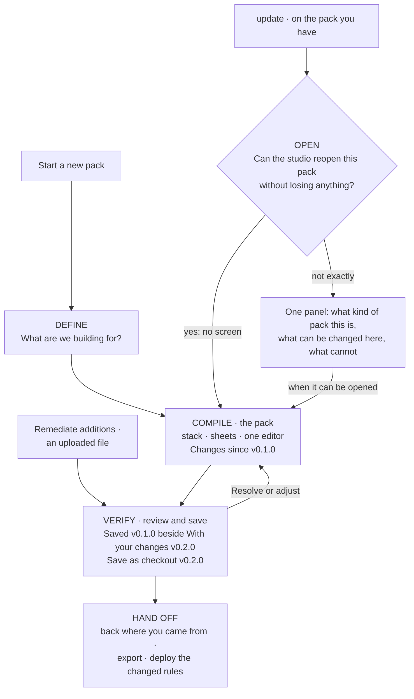

# The UPDATE journey

**Status: proposal, 2026-10-02. Nothing in this document is built.** It is the
user journey for changing a pack that already exists — the second half of
*Build or update a pack*. It is written against today's code: every stage says
what it reuses and what is new, and the examples use numbers the engine
actually produces. It comes in three slices. **Adding an SLO, an alert or a
route arrives with the second**; the first only opens the door. Eight
decisions at the end are the owner's.

The BUILD journey ([`BUILD_JOURNEY.md`](BUILD_JOURNEY.md)) is for a team with no
pack. Once the pack exists, the studio has no way to adapt it.

## The job

> We shipped the pack for `checkout` last month. I need to add a 99.95% SLO, send
> SEV2 to the new on-call webhook as well, and fill the on-call channel we left
> as a placeholder — without rebuilding the pack from the wizard and without
> losing what is in it.

Four more jobs the journey must answer, one way or another:

- change an objective, a threshold or a window;
- add an alert;
- the pack was scanned from our repository and I want to adapt it;
- Compare showed alert rules reading a metric production does not emit — fix it.

## Why it is hard today

Three facts about the code decide what this journey can promise.

1. **Build is a generator, not an editor.** A pack is a pure function of nine
   inputs (name, owners, environment, tier, library entries, params, section
   switches, SLI selection with overrides, custom SLIs), and every change
   regenerates the whole pack (`instantiatePack`, `tools/lib/library.mjs`).
   Nothing patches a pack. Build keeps one draft of *inputs* in the browser and
   cannot load a pack at all.
2. **The owner's own examples are outside the generator.** It writes exactly one
   SLO per SLI, with the id built from the objective; one burn-rate alert per
   SLO, with windows from fixed profiles; exactly three routes. A second SLO on
   an SLI, an alert with its own windows and a fourth route cannot be
   expressed. Today "add an SLO" can only mean "add another SLI".
3. **A pack has no identity that survives an edit.** The catalogue id is a hash of
   the content and the version is the constant `0.1.0`. Saving a changed pack
   adds a second entry beside the first; the two read identically in the picker
   and nothing links them.

Two things work in the journey's favour. A pack Build made carries its own inputs
as `library.*` annotations, and regenerating from them gives back the same pack.
A first run over six cases was identical in five; the sixth is a custom SLI in a
pack with SLOs switched off, whose objective is stored nowhere. The same run on
a pack edited by hand (a fourth route, a third SLO) regenerated it with three
routes and two SLOs and no warning: that silent loss is what the first stage
exists to prevent. And the working surface already exists: the layer stack, the
per-layer sheets and the one pop-up editor.

## One idea the journey rests on: additions

Build cannot write a second SLO or a fourth route, and widening the generator
for each is slow. So a pack an update has touched is **Build's output plus a
recorded list of additions**. An addition is one artefact the user added by
hand; it is recorded in the pack itself and put back after every regenerate, so
it can never be dropped. For a pack Build did not make, the pack is simply the
saved pack plus additions. This is decision 2.

## The journey at a glance

One journey, two starts. Build keeps its three steps, their names and its
screen. *Update* is a second door that opens an existing pack and lands on the
pack itself, not on the wizard's first question. The tabs read the same in both:
**Define · Compile · Verify**.

| Stage | The user's question | The studio's answer |
|---|---|---|
| Open | Can I change this pack, and will anything be lost? | Proves it can rebuild the pack as saved, or says exactly what it cannot. |
| Compile | Where do I add or adjust it? | The pack on the Build screen, with a running list of changes. |
| Verify | What does my change do, and is it fit to save? | The saved pack beside the pack with the changes; then the next version of the same pack. |
| Hand off | How does it reach production and the repository? | Export; deploy the changed rules and dashboards; nothing claimed that no record shows. |

## Where it starts

`update` is an operation on a pack, so it sits with the other operations.

| From | Control | Lands on |
|---|---|---|
| Any workspace screen with Pack A loaded | Header button **`update`**, in the operations row beside `export`, shown when a pack is open. A button like its neighbours, never a menu item. | Compile, on that pack (one click when the pack reopens exactly). |
| Home | The second card becomes **Build or update a pack**: *Start a new pack* · *Update a pack you have*, followed by this workspace's packs (`name · version · where it came from`). | Define for a new pack; Compile for a picked one. |
| Remediate, after *Update repository from live* generates its additions (slice 2) | **Open as the next version of `<pack>`**, beside the two downloads it offers today. | Verify, with what was adopted as additions. |
| `upload`, when the file's name is a pack you own (slice 2) | **Save as the next version of `<pack>`** · *Keep as a separate pack*. | Verify, with the file's differences as the changes. |

Writing a pack needs the operator role, as every write does today. A viewer
sees `update` disabled, with the reason. Discover gains nothing: it stays a
catalogue with no next action.

## The stages

### 1. Open

**The user wants** the pack they already have, editable, without re-answering the
wizard — and to know nothing in it will be lost by opening it.

**What the studio does.** It reads the pack as stored, recovers Build's inputs
and the recorded additions from it, regenerates, and compares the result with
the stored pack, ignoring formatting differences. It trusts no marker: a pack
edited by hand keeps its `library.*` annotations, so only the comparison can
tell.

**What the user sees.**

- *The pack reopens exactly*: no screen. They land on Compile with one line:
  *Opened checkout v0.1.0. Build rebuilt it from its own definition and got the
  same pack.*
- *Otherwise*, one panel in the screen grammar — context
  (`checkout · prod · Pack A · v0.1.0 · made in Build`), one sentence, one action,
  and two lists written for this pack: **Can be changed here** / **Cannot be
  changed here yet**.

| The pack | The sentence | The action |
|---|---|---|
| Build already holds unfinished work (a new pack, or an update of another pack) | *You are updating orders (3 changes, not saved).* The changes are named. | *Continue it* · *Discard it and open checkout*. Never replaced unasked. |
| Made in Build; Build would write some values differently today | *Build would write 2 values differently.* Each is listed, pack value beside Build's. No cause is claimed: the studio cannot tell a hand edit from a library change. | *Open with Build's values* — each then appears on Verify as a change. An SLI's values can instead be kept as the pack has them; the SLI then reads *customised*. Other values cannot be kept before slice 3: *Leave the pack as it is*. |
| Made in Build; holds things Build did not write (a hand-added route, artefacts adopted from live) | *This pack holds 3 things Build did not write.* Each is named. | Slice 2: they are read in as additions and the pack opens. Slice 1: *Leave the pack as it is*; the alternative is a new pack under a new name, without the three named things. The original is never changed. |
| Several packs in the workspace share this name (today's Build hand-offs left twins) | *3 packs are called checkout.* Each is listed with its date and deploy records. | Opens the one in Pack A. The first Save asks, for each other one: *an earlier version* or *a separate pack*. |
| Uploaded or written by hand | *Build did not make this pack, so it has no definition to reopen.* | Slice 2: add to it; change it by file (*upload as the next version*). |
| Scanned from a repository | *This is a reading of the repository taken on 1 Oct. The next scan replaces it. To change what it holds, change the repository and scan again.* | Slice 3: *Keep as my pack* (decision 3). Before that, no action here. |
| Drafted from live | *This is what the live system reported at 14:02. The next draft replaces it.* | Same as a scan. |
| A reference or example pack | *It ships with the studio and is read-only.* | *Save a copy as your pack…* |

**Reuses:** the `library.*` annotations, `instantiatePack`, `restoreBuildDraft`
(a seeded draft lands on Compile), the decision header.
**New:** the reader (pack → Build inputs), the comparison and its normal form,
the panel, the draft tied to the pack it updates.

### 2. Compile — change the pack

**The user wants** to do the job: add the SLO, the route, change the objective,
fill the value.

**What the user sees.** Today's Compile: the definition column on the left, the
layer stack on the right, a sheet per layer, the one pop-up editor. Four things
change.

- **The context line names source and destination**:
  `checkout · prod · tier-2 · updating v0.1.0 → saves as v0.2.0`. An update
  edits the pack's own values, not an environment's overlay; when ENV A is not
  the pack's environment the line says so.
- **The definition column lists the add actions as buttons** — `+ SLI` ·
  `+ SLO` · `+ Route` — each opening the sheet where it lives (L1, L1, L4), so
  nobody has to know the layer first.
- **Under them, "Changes since v0.1.0"**: one row per thing the user did, in
  their own terms, each with *undo* —
  *Added SLO availability 99.95%, with its burn-rate alert*;
  *Added route SEV2 → webhook*;
  *Filled on-call channel → routes SEV1 and SEV2 no longer rest on a template value*.
  It replaces *Changes since Define*, which compares with library defaults. On
  the stack the same facts show as `new` and `changed` chips.
- **Where something cannot be changed yet, the sheet says so** in the place the
  user would look for the control.

**What can be changed.**

| What | Add | Change | Remove | Arrives |
|---|---|---|---|---|
| SLI, with its SLO, burn-rate alert, recording rule and panels | yes | yes (11 fields, rename included) | yes | slice 1 (Build does this today) |
| Objective, window, threshold, direction, expression | — | yes | — | slice 1 |
| Values: channels, pager, endpoints, versions, runbook folder | — | yes | — | slice 1 |
| A whole section (SLOs, policy, routes, dashboards, validation) | switch on | — | switch off | slice 1 |
| Technology (library entries), tier | yes | yes | yes | slice 1 |
| **A second SLO on an SLI, with its burn-rate alert** (own windows and severity) | yes | — | only what was added | slice 2, as an addition |
| **A route** (severity → channels) | yes | — | only what was added | slice 2, as an addition |
| The windows of an alert Build generated; a generated route | — | — | — | slice 3; by file until then |
| Recording rules, dashboards and panels, backends, pipelines, baselines | — | — | — | slice 3; by file until then |

Three limits the forms state before a change is accepted:

- **A burn-rate alert belongs to one SLO, and an SLO has one.** Every SLO Build
  writes already has its alert, so an alert is added *with* an SLO, not on its
  own (decision 1).
- **An added SLO is not wired like a generated one.** It has its alert; it is
  not on the overview or SLO-burn boards and has no forecast until slice 3.
  The form says so.
- **A route is added beside the generated ones.** A second SEV2 route sends
  SEV2 to the webhook *as well as* the existing channel; the generated SEV2
  route cannot be changed or removed before slice 3.

**Reuses:** `build-stack-view`, `build-sheet-view`, `build-editor-view`, every
action on `host.build`, the retarget helpers that keep edits across a tier change.
**New:** the changes list (a diff of the definition, plus the additions), the
two *add* forms in the editor, the add buttons in the definition column.

### 3. Verify — review and save

**The user wants** to see what the change does before it replaces the pack, and
then have the pack they use be the changed one.

**What the user sees**, in this order:

1. **Two pack cards side by side**: *Saved · v0.1.0* and *With your changes ·
   v0.2.0*, and under them `only in saved 0 · in both 38 (2 changed) · only with
   your changes 3`.
2. **One decision sentence and the primary action**: *3 changes: 3 artefacts
   added, 2 changed, none removed. The pack still meets tier-2.* →
   **Save as checkout v0.2.0**. Secondary: *Save as a new pack…*
3. **Two columns**, one row per touched artefact, an edit as one row with the
   old value on the left and the new on the right. The rows come from the
   changes list and from a comparison of the two packs, artefact by artefact;
   anything the list does not explain is shown under **Also changes**, so
   nothing moves silently.
4. **No longer in the pack, possibly still live** — named, when a change removes
   or renames an artefact. Deploy creates rules and does not delete them.
5. **Does it measure anything?** For each new or changed expression: *reported
   by the live system at 14:02* / *not reported* / *not checked — no live pack
   is loaded*. An update must not create the very finding Compare exists to
   catch (decision 6).
6. **What is ready and what remains** — Verify's four readiness states and the
   placeholders with their inline inputs, as today.

The comparison uses the pack as stored, not the environment-overlaid one. The
existing Compare is not used: run on two versions of one Build pack it showed
what was added but put a changed objective's old SLO out of scope and never
showed a filled value, because template values are not paired. It stays what it
is — Pack A beside Pack B — and this journey does not change it.

**What Save does.**

- **Same name, same pack.** The pickers list the pack once, at its current
  version: `checkout · v0.2.0`. Earlier versions sit under it
  (`checkout · v0.1.0`) and can be picked like any pack.
- **Versions are kept.** A save removes nothing. Saved versions are exempt from
  the workspace's 200-pack limit, and `reset` says how many it will delete
  (decision 7).
- **Pack A moves** to the new version. **Pack B is never touched.**
- **Going back** is *Restore v0.1.0*: its content saved as the next version.
- **Save is refused** if someone else saved the pack since this update began;
  the changes are shown again on the newer version, and any that no longer
  apply are kept in the list and marked, not dropped.
- **Unsaved work is never a pack in the catalogue**, so it cannot be exported,
  compared or deployed by accident.

**Reuses:** Verify's readiness and its clause states, the compile previews,
the look of Compare (cards, the three numbers, two columns),
`POST /api/library/register`, the way *Open pack in Discover* selects Pack A.
**New:** the review model (changes list + artefact-by-artefact comparison),
the *possibly still live* list, the live check line; a register that takes the
pack's name as identity, bumps the version and keeps the one it replaces (the
existing replace-by-label deletes it); restore; the refusal on a moved base;
the exemption from eviction.

### 4. Hand off

**The user wants** the change to exist where it matters.

After Save they are back on the screen they came from, with one message built
only from records:

> Saved checkout v0.2.0 — 3 changes. v0.1.0 is kept. No deploy of v0.2.0 is
> recorded here; v0.1.0 was deployed to prod on 5 Sep.

or, when there is no record: *…so what is live is not known from here.*

The primary action is **Export v0.2.0** — the pack and every compiled file,
for the repository. The studio deploys rules and dashboards only; **routes,
pipelines and backend values leave by export**. A scan reads the compiled
files, not a committed `pack.yaml`; the message says which files changed.

Two more buttons:

- **Deploy the changed rules and dashboards** — Remediate's deploy review with
  the rows this update changed selected.
- **Put v0.1.0 in Pack B** — Compare then shows what was added; a changed
  objective or a filled value is shown truthfully only on Verify, and the
  button says so.

A captured check (a saved *journey*, which re-checks a pack on a schedule)
moves to the new version, or the message says it is still checking the old one.

**Reuses:** Remediate's deploy review and its records, `export`.
**New:** the pre-selection, the message, exporting the pack as stored, the
captured check following the pack.

## Four walkthroughs

Counts are from a tier-2 `http-service` pack: 38 artefacts.

**Add a 99.95% SLO** (slice 2). `update` → Compile on checkout v0.1.0 → `+ SLO` →
the L1 sheet, on the availability SLI → type `99.95`; the window stays 30d; its
burn-rate alert is on, windows prefilled → *Add* → **Verify** →
`only with your changes 2` (the SLO and its alert) → **Save as checkout v0.2.0**.
Six clicks and one typed value. The alert becomes two rules when compiled;
*Deploy the changed rules* puts them live.

**Send SEV2 to the new webhook as well** (slice 2). `update` → `+ Route` → the L4
sheet → severity `SEV2`, channel kind `webhook`, the URL → *Add* → Verify →
`only with your changes 1` → Save. SEV2 now goes to the existing channel and to
the webhook. The route is an Alertmanager file: it leaves by **Export**, not by
deploy.

**Change an objective** (slice 1). `update` → the availability SLI card → the
editor → objective `99.5` → `99.9` → *Save SLI* → Verify. One row for the SLO —
its id is built from the objective, so `availability_99_5` becomes
`availability_99_9` — and under **Also changes** the five artefacts that name
it: its burn-rate alert, the two boards, a panel and the chaos experiment. At
tier-1 the forecast, the customer-impact board and the remediation trigger move
too. Under *No longer in the pack, possibly still live*: the old SLO's
recording and burn-rate rules → Save.

**Compare showed six alert rules reading a metric production does not emit.**
Pack A is a scan. Those rules are files in the repository that the scan
recorded as readers; they are not pack artefacts. The honest path is the
repository: change the rules, scan again, and the finding clears or stays.
`update` on the scan says so. Once the scan can be kept as an owned pack
(slice 3), what can be done there is add — the SLO and alert the service
should have had.

## What the journey never does

- Drop something from a pack without naming it first.
- Let a pack that is an observation (a scan, a live draft) be edited in place.
- Say a version is deployed, or was cleaned up, when no record shows it.
- Show an edited artefact as *Verified* by a live check that predates the edit.
- Move a value the user did not touch without listing it under *Also changes*.
- Offer a control that cannot do what its label says.

## What it needs before it is promised

Two tests, written first, because the one-click path rests on them:

1. **The round trip.** Every library entry at every tier, with and without
   edits, saved to the workspace as YAML and reloaded: recover the inputs,
   regenerate, compare. Today a reloaded pack is not equal to itself —
   multi-line expressions gain a newline on the way through YAML — so the
   comparison needs one defined normal form (or the YAML fixed).
2. **The change list is true.** For a scripted set of edits the review must
   report exactly the artefacts that differ between the two packs.

## Slices

| Slice | What the user gets | What it cannot do yet | Size of the change |
|---|---|---|---|
| **1. The door and the version** | `update` on a pack made in Build and untouched since: open, change what Build can already change, review, save as the next version, export, deploy the changed rules. | Add a second SLO, an alert or a route. Open a pack that was added to by hand or by Remediate. Anything on a scan or a live draft. | Studio and server. No change to generated output. |
| **2. The additions** | **+ SLO on an SLI with its alert, + route**, recorded in the pack and kept across every regenerate. Packs added to by hand or by Remediate open. *Open as the next version* from Remediate; *upload as the next version*. | Change or remove what Build generated beyond its inputs. Scans and live drafts. | A new engine module built from the insert logic in `tools/lib/retrofeed.mjs`, with a real duplicate check for routes and an id check that sees additions; the instantiate and register routes; the Build stack, sheet and Verify models, which read the generator's output only today; upload that validates without registering. No change to generated output. |
| **3. Any pack** | *Keep as my pack* for a scan or a live draft; changing and removing artefacts Build did not write, and the windows and routes it did; wiring an added SLO to the boards; environments. | — | A second edit model (patch the pack). |

## Decisions for the owner

1. **What is "an alert"?** The pack spec has two kinds, both bound to an SLO: a
   burn-rate alert and a forecast, plus routes. A scanned repository also holds
   plain alert rules (*queue depth above 1000 for 5 minutes*), which are not
   pack artefacts. (a) In this journey "add an alert" means *add an SLO with
   its burn-rate alert*, with its own windows and severity. (b) Plain threshold
   alerts become pack artefacts: a change to the spec, the compiler and the
   downstream studio; until then they cannot be added in any slice.
   *Recommended:* (a) now; (b) is worth its own decision, because it is what
   most people mean by "add an alert".
2. **How do things Build cannot generate get into a pack?** (a) As *additions*
   recorded in the pack on top of Build's output and re-applied on every
   regenerate. Cost: an added SLO has its alert but is not on the boards and
   has no forecast until slice 3. (b) By widening the generator's inputs: fully
   wired, but slower, only for packs Build made, and every change moves the
   library fixtures.
   *Recommended:* (a). It is the only option that works for a pack of any
   origin and makes hand-edited packs openable.
3. **Scanned and live-drafted packs.** (a) Never edited in place; *Keep as my
   pack* makes an owned copy; the scan stays in the catalogue and Pack B is
   left as it is. In slice 3 — or adds-only in slice 2, at the cost of a second
   set of sheets for packs Build did not make. (b) Refuse, and start a new pack
   in Build.
   *Recommended:* (a), in slice 3. Until then `update` on your own scan and
   live-draft packs answers with what they are and no action; if adapting a
   scanned pack is the first thing you want to show, say so and adds-only
   moves into slice 2.
4. **What Save does with the version it replaces.** (a) One row per pack, earlier
   versions kept under it and restorable; (b) every version a separate row in
   the picker.
   *Recommended:* (a).
5. **A shortcut from the artefact drawer.** A *Change in the pack →* button on
   an artefact in Discover would save two clicks, and would be the first next
   action on a screen that has none.
   *Recommended:* no, for now.
6. **Check new expressions against live before saving.** *Recommended:* yes, as
   a line on Verify that states what was checked and when — never a gate.
7. **Where a saved pack durably lives.** Today a workspace holds 200 packs,
   removes the oldest beyond that, and `reset` clears them all. (a) Saved
   versions are exempt from both, and `reset` names what it deletes; (b) the
   workspace stays a scratch space and every Save ends with *export and
   commit* as the durable copy.
   *Recommended:* (a), with Export as the primary hand-off either way.
8. **What ships, under what name.** Slice 1 alone opens the door onto what Build
   can already do. (a) Ship slices 1 and 2 together as *Build or update a
   pack*; (b) ship slice 1 first, with the button named `open in build` until
   slice 2 lands.
   *Recommended:* (a). A button named `update` that cannot add an SLO would be
   the first thing you try and the first thing that says no.

## Not in this journey

- Editing dashboards, panels, recording rules, backends, pipelines and
  baselines artefact by artefact (by file until slice 3).
- Editing the environment overlays of a pack.
- Removing rules from a live system. Deploy creates and does not delete; the
  journey lists what is left behind.
- An audit of who changed what. The write routes record nothing today
  ([`STORE_PLAN.md`](STORE_PLAN.md), slice 4).
- Updating a pack from the command line. `packc` can create a pack (`init`)
  but has no command that updates one.

## See also

- [`BUILD_JOURNEY.md`](BUILD_JOURNEY.md) — the journey this extends: the steps,
  the screen, the library, the editor.
- [`UX_SCREEN_GRAMMAR.md`](UX_SCREEN_GRAMMAR.md) — context, decision, next
  action; what is not simplified.
- [`USER_JOURNEY.md`](USER_JOURNEY.md) — Discover, Diagnose, Remediate.

## Decisions — downstream seams (2026-10-03)

A private downstream distribution used to consume Observogram by vendoring a
few modules and re-implementing the rest, and every upstream release cost a
porting campaign. The series of *downstream seams* inverts that: upstream is
the product with documented extension points, a downstream runs a vendored
snapshot plus a thin private layer, and an update is a snapshot bump. Each
seam is inert by default — with no configuration present, behaviour and every
golden output are byte-identical — and each adds its paragraph here as it
lands.

**W1 — the vendorable-module manifest.** Delivered as
[`VENDOR-MANIFEST.json`](../VENDOR-MANIFEST.json), generated by
`tools/gen-vendor-manifest.mjs` and guarded by `tools/test-vendor-manifest.mjs`;
[`DOWNSTREAM.md`](DOWNSTREAM.md) is the workflow. Decisions: the manifest
covers `tools/lib` only (the zero-import studio modules stay in
`VENDORING.md`'s table; folding them in is a follow-up that would also admit
`retrofeed.mjs`); `--verify` and `--smoke` live in the generator so one
self-contained file travels with the manifest; no `specVersion` field (the
validator owns the spec version and its sha256 already moves with it); a
missing previous manifest is the release baseline, no `--init` — the
breaking-change flags are computed against the committed manifest of the same
version and reset when the version changes, so the release commit regenerates
the file; export extraction is a one-pass tokenizer, not regex stripping,
because `compile.mjs` carries a `/*` inside a `//` comment and a `/* … */`
inside a template literal, and the DOM purity rule matches identifier access
only, because three modules say "window." in template prose; a module new
since the release stays flagged (`releasedExports: null`) until the release,
and one added and removed inside the same window is never reported as
removed. Config surface at runtime: none — nothing under `server/`,
`studio/` or `tools/lib` reads the manifest. Scripts: `vendor-manifest`,
`vendor-manifest:check`, `lint:vendor-manifest`, `test:vendor-manifest`.
Tests: 689 → 700.

**W2 — the transport hook.** Delivered as `OBSERVOGRAM_TRANSPORT_HOOK`
([`MCP_INTEGRATION.md`](MCP_INTEGRATION.md), "Transport hook"): one MCP send
path in the new, vendorable `tools/lib/mcp-client.mjs` (the client left
`tools/fetch-live-pack.mjs`, which keeps re-exporting `createMcpClient` so
the recorder and the deploy routes import it unchanged), a Node-only loader
`tools/mcp-transport.mjs`, and the URL policy moved into
`tools/lib/mcp-url-safety.mjs` (`mcpUrlPolicy`; `server/mcp-url.mjs`
delegates byte-identically). Decisions: the hook path resolves against the
working directory, the way `OUTPUT` and `MCP_URL` are read; the hook applies
to the server's MCP calls too — loaded once per process, logged once by each
entrypoint (the CLI on stderr, the server through `log()` so a silent boot
stays silent), never by the loader; only contract faults are wrapped as
`TransportHookError` — a rejection from native `fetch` or from the hook's own
`fetchImpl` stays an ordinary wire error, so a 503 on one probe is retried
and annotated exactly as without a hook, and installing a header hook never
turns a transient failure into a FATAL exit; returned headers are merged over
the built ones, so a hook that adds one header does not drop
`Mcp-Session-Id`; CR or LF in a returned header is a fault, because a custom
`fetchImpl` may not refuse it; the client redacts the bearer *and* every
credential value of the URL (userinfo, `token=`-style parameters) from the
hook's own error text — a `prepareRequest` throw, a `fetchImpl` rejection
and the text of a Response the `fetchImpl` *returns* (a non-OK body, a
JSON-RPC or SSE error message) — since the raw caller URL reaches the hook;
a native `fetch` answer is not hook text and passes through untouched; the
journey run record and its kept live snapshot persist `packB.mcp.url` in
`safeMcpUrl()`'s form too (found while checking this: the record had carried
the def's URL with its `token=` parameter since the engine was written); a
`fetchImpl`-only hook skips the final-URL re-check (the URL is the caller's,
already validated); every swallowing catch — the fetcher's `safe`, `quiet`,
initialize/notify/tools-list, the per-kind inventory catch and the three
default `quietly` fallbacks of the probe helpers, the recorder's `attempt`,
the journey engine's vantage-lost and inventory catches, the deploy routes'
per-item catches and the snapshot capture — rethrows a hook fault, so the
hard fail is hard everywhere: no pack, no fixture, no run record, no deploy
or rollback record, one 502. Config surface: `OBSERVOGRAM_TRANSPORT_HOOK`
(legacy `TOMOGRAPH_TRANSPORT_HOOK` honoured, the modern name in every
message); no route, no flag. Inert when unset: the request log is identical
with no hook and with an identity hook, and the goldens are byte-identical.
Tests: 700 → 706 (`tools/test-mcp-transport.mjs`,
`server/test-transport-hook.mjs`; `test-fetch-live`, `test-record-fixtures`
and `test-journey` extended and made hermetic to the variable).

**W3 — the artefact taxonomy classifier.** Delivered as
`tools/lib/artefact-classify.mjs` (zero-import, vendorable), bound into the
studio through `studio/taxonomy.mjs`, with the operator override
`OBSERVOGRAM_TAXONOMY` served at `GET /api/taxonomy` (README, "Classify
Typed Packs"; [`ADAPTER.md`](ADAPTER.md), "Id families and the classifier").
Decisions: the *family* is the mapped unit, not the layer — a family has one
home (`FAMILY_HOME`: layer, group, label, role), so one vocabulary serves
the board, the row kinds, the drawer, the diff's identity keys, the
traceability graph and the blast radius, and an operator names a family, not
a place; the board never moves an artefact across layers — it groups what
the pack put on a layer, and a family whose home is elsewhere is that
layer's "Other", because the layer is the pack's own statement and the board
only reads; the order is `type` → `defines` → override id rules → id prefix:
`defines` is Observogram's canonical symbol and can never be re-homed by a
regex (the override only has to beat the id heuristic, which is all a
foreign pack reaches), proven by the vendored example classifying
byte-identically under a `^SLI-` override; type names match exactly
(case-sensitive) — a mapping file is written once and ambiguity costs more
than a capital letter; the ids the adapter numbers once (`OTEL-01`,
`PIP-EXP-MET`, `STO-MET-01`, `PROF-01`, `NET-01`, `POE-01`, `BASE-01`) became
prefix rules so the board's grouping is byte-identical today and a second
id in such a family lands with the first tomorrow — a `PIP-EXP-`/`STO-` id
with a signal segment the adapter never emits has no family, where the old
prefix table would have grouped it; the server refuses a bad file instead of
ignoring it — a silently dropped override would group every typed pack
wrong with no sign of why — and reads it before the store boots, so nothing
is written; the file's path is logged once and never served
(`configured: boolean`), like the transport hook's; the studio binding
degrades to `via: 'unbound'` everywhere but the board, which cannot group
unbound and throws the named error, so headless and pre-boot renders of
adapted artefacts keep working; a declared per-artefact `type` passes
through the legacy upconvert (`observogram.artefact.type.<symbol>`) and
`adapt()` so a typed layered upload reaches the board through the one
canonical pipeline — the critic's finding that no product path carried
`type` — and the inertness claim ("adapted packs never carry `type`") is a
guard test, not an observation; the one default-behaviour change — an
artefact declaring a family name in `type` classifies by it with no
configuration — is pinned by the typed fixture's unmapped golden. Config
surface: `OBSERVOGRAM_TAXONOMY` (legacy `TOMOGRAPH_TAXONOMY` honoured),
`GET /api/taxonomy` (viewer, no-store), the annotation
`observogram.artefact.type.<symbol>`; scripts `test:golden:board`,
`test:golden:board:update`, `test:artefact-classify`, `test:taxonomy`,
`test:declared-type`. Inert when unset: the board and families of all 1049
catalogue artefacts, the crawl and compile goldens and every self-diff are
byte-identical, with and without an override installed. Tests: 706 → 731
(`tools/test-golden-board.mjs`, `tools/test-artefact-classify.mjs`,
`tools/test-declared-type.mjs`, `server/test-taxonomy.mjs`;
`test-discover-rows`, `test-smoke`, `test-authz`, `test-tenancy` extended).

**W4 — the rebadge pack.** Delivered as `tools/lib/brand.mjs` (zero-import,
vendorable) with `loadBrand()` in `tools/lib/brand-env.mjs`, the shell routes
`GET /` and `GET /index.html` in `server/index.mjs`, `studio/brand.mjs` →
`state.brand.chrome` in the studio, the auth pages from the brand, and
`--brand` / `--out` on `tools/gen-design-tokens.mjs` (README, "Rebadge The
Studio (brand config)"; [`DOWNSTREAM.md`](DOWNSTREAM.md) §9). Decisions:
*injection, not a `/brand.json` fetch* — the server renders the brand into
the shell (`#brand-config`) so the studio's first paint already has it and a
static host could do the same; *routes, not the static index* — `GET /`
and `GET /index.html` are handlers before the mount (`index: false`,
no `extensions`), which is what lets the default stay `res.sendFile` (the
same `send` pipeline, byte-identical, the same headers, 304 on a
conditional GET) while a branded deployment answers a rendering, and what
closed the `GET /index` leak the old `extensions: ['html']` left open; *one
name derives everything* — `shortName`, the wordmark, the scanner title,
the compass mark, the footer text, the hero alt, the description, the links
and the changelog link all follow `name` unless the file names them, so a
one-variable `OBSERVOGRAM_BRAND_NAME` rebadge leaves no upstream string
behind (and a named brand shows the CSS fallback rather than upstream's hero
art), while `DEFAULT_BRAND = normalizeBrand({})` keeps today's literals
exactly; *no literal fallback in the studio* — every chrome renderer reads
`state.brand.chrome`, and a renderer without it paints nothing in that place
(`renderVersionChrome`'s tooltip, the atlas compass), because a fallback
literal is a second source of truth the source guard would then have to
allow; *the brand is read in `start()`*, not at import, so the in-process
suites' env hygiene (set before `start()`, after the hoisted import) holds
for it as it does for the taxonomy and the transport hook; *escaping
everywhere, one raw field* — `logo.svg` is inline SVG trusted like the
brand file itself, injected only by `innerHTML` in the JS header, refused
on `<script`, and never reaches the server-rendered shell or auth pages;
*the tokens mirror the cascade* — the JSON generator applies the light map to
both themes because the injected `:root{}` wins over the CSS's
`[data-theme="dark"]{}` at equal specificity, and takes `--brand` only
explicitly so `--write` keeps regenerating the vendorable default; *the
default-mode boot order changed and says so* — `boot()` awaits the brand
before mounting the header, the load is kicked off at module top level and
preloaded by the shell, and the CHANGELOG states the extra request rather
than claiming zero behavioural change. Deferred: `--brand` for the static
bundle (built from the unbranded shell; `studio/static-backend.mjs` is
exempt from the source guard for that reason), the CLI banner and the
schedule snippets (CLI output, not studio chrome), and the lowercase noun
"its observogram" (the diagram's name, kept). Inert when unset: the shell
is the same string, every chrome string is the literal it replaced, the
goldens and `studio/design-tokens.json` are untouched. Tests: 753 → 776
(`tools/test-brand.mjs`, `server/test-brand-shell.mjs`; `test-authz`,
`test-build-info`, `test-vendor-manifest` extended). Verified in headless
Chromium at 1366 and 390 px: header, footer, About and the sign-in page,
default and branded.

**W5 — reverse-proxy identity passthrough.** Delivered as
`server/auth-proxy.mjs` behind `OBSERVOGRAM_TRUST_PROXY_AUTH=1` (README,
"Behind a reverse proxy (trusted headers)"), with `proxySignIn` /
`syncProxyMembership` in `server/store/identity.mjs`. Decisions: the rows are
kind `oidc` under a `proxy://<realm>` key (`proxy://<realm>#<user>`) — no
migration (the users table's CHECK stays), and every store operation, CLI
and the identity API that knows an OIDC row knows these for free; the price
is that `packc store rekey-issuer --clear` disables them too, which the
README says; a dedicated kind would need a table rebuild and buys nothing
today. No cookie: the headers ARE the session, resolved once per request
(cached on the request, so the gate and `/auth/me` open one transaction),
because a cookie beside trusted headers would be a second identity to keep
in sync and a second thing to revoke — revocation is the proxy's job, and
ours is to refuse a disabled row. CSRF stays: the headers are ambient
exactly like a cookie (a cross-site POST through the proxy carries them),
so the session principal and its `X-Observogram-CSRF` rule are unchanged,
proven by the suite. The acknowledgement is a sentence, not `1`, because the
one thing the server cannot verify — that the proxy is the only route to
the port and strips the identity headers — is the whole security argument,
and a flag someone copies from a snippet is not an acknowledgement. Beyond
loopback the shared secret is a hard refusal, not a warning: the ACK speaks
for the network path, the secret for the request, and a warning that is
read once is not a defence. On loopback without it the boot warns once
(every process that reaches the port is the proxy). Groups are authoritative
in the configured org only: a proxy that sends the header is the source of
truth for that org, so a membership there is raised, lowered or removed to
match on every request that carries it (an admin's manual edit there is
overwritten; other orgs are never touched; a request without the header
changes nothing), and an empty header is a statement — no groups. A join
role beside a groups header refuses the start (as `_GROUP_ROLES` without the
header does): the store applies the join role exactly when the proxy made no
statement about groups, so beside a configured header it would rule every
request that omits the header, not "when no groups header is configured" as
documented — `none` spelled out is fine. Owner is
grant-only: a user dropped from the owner group stays owner until an owner
revokes it, because an owner losing a group should never silently lose the
deployment, and the audit must show a person's revoke. OIDC beside the flag
refuses rather than one winning silently, checked before the OIDC branch in
`initAuth()` and in `bootContext()`. Duplicate header lines are counted on
`req.rawHeaders` because Node joins them into one value (`alice, root`) and
a login nobody intended must never be created. `GET /auth/login` is a 401
explainer, not a redirect: there is no page to sign in on, and the proxy's
own URLs are its business — the studio's sign-out goes to
`OBSERVOGRAM_PROXY_AUTH_LOGOUT_URL` when configured and otherwise says it
signed out of this app only. The one default-behaviour change — `GET
/api/admin/join-role` gains `mode` — is pinned in `test-identity-api` and
`test-auth-oidc`. Config surface: `OBSERVOGRAM_TRUST_PROXY_AUTH`,
`OBSERVOGRAM_TRUST_PROXY_AUTH_ACK`, `OBSERVOGRAM_PROXY_AUTH_REALM`,
`_USER_HEADER`, `_EMAIL_HEADER`, `_NAME_HEADER`, `_GROUPS_HEADER`,
`_GROUP_ROLES`, `_ORG`, `_JOIN_ROLE`, `_OWNERS`, `_SHARED_SECRET`,
`_SECRET_HEADER`, `_LOGOUT_URL` (legacy `TOMOGRAPH_*` honoured); route-table
mode `proxy`; `identity_mode` `proxy:<key>`; no new route. Inert when unset:
no header is read in any posture (proven on an open-loopback and a
local-users server), and nothing under `tools/` changes, so the goldens are
byte-identical. Tests: 731 → 745 (`server/test-auth-proxy.mjs`;
`test-authz` inventories the fourth mode).

**W6 — the embeddable studio bundle.** Delivered as
`tools/build-studio-bundle.mjs` (`npm run build:studio`) and
`studio/static-backend.mjs` (README, "Serve The Studio Without The Server";
[`DOWNSTREAM.md`](DOWNSTREAM.md) §10). Decisions: the inlining is an inline
import map of `data:` URLs — one key per studio and `tools/lib` module, only
the import-specifier strings rewritten — rather than nested `data:` URLs (a
relative specifier cannot resolve against a `data:` base, and nesting is
exponential), `blob:` URLs (a runtime step before the import map, the same
base problem) or a concatenation registry (rewriting `import`/`export` syntax
by hand across 2 MB of untyped browser code, with silent failure modes); the
price is base64's third and stack traces that name `data:` URLs, and a host
whose CSP forbids `data:` in `script-src` waits for a `--split` directory
form. The browser-side backend mirrors the server's handlers over the same
`tools/lib` engines instead of importing server code — `server/index.mjs`
cannot run in a browser (Express, the store, the file system), and a port
whose every route is compared against a running server (`test-studio-bundle`
T5, over an example pack and a library-built one so `onPlaceholder` is
compared too) is a contract the server cannot drift away from unnoticed;
`pack-registry.mjs`'s `slugify` is copied with its source named for the same
reason. Compare is out: the server's diff carries the traceability graph,
whose PromQL parser is a bare node dependency, and a diff without it would
grade differently from the server — a different verdict for the same packs
is worse than a sentence saying the feature needs the server; inlining the
parser's ESM dists is the follow-up. Everything the server alone can do
answers `501 denied: 'no-backend'` with a sentence naming the feature, because
the studio already shows a `denied` body verbatim — one shape, no new client
code. Export is taken over in the capture phase and downloaded as a Blob,
because the studio's own button navigates and a fetch wrapper never sees a
navigation; the `api` link and menu item are disabled for the same reason.
The shim imports `tools/lib` statically and relatively (`../tools/lib/…`)
instead of the live studio's `import('/lib/…')`: it must link headlessly
under Node for the parity suite and resolve in the bundle's import map, and
the live server never loads it (nothing in the live studio imports it). A
`--pack-url` with userinfo or a credential query parameter is refused and
`--json` prints URLs stripped, because the bundle is a file that gets
distributed. The default is an empty catalogue plus the notice, not the
vendored example — a downstream ships its own packs. Playwright is resolved
through `OBSERVOGRAM_PLAYWRIGHT` or the bare `playwright` and never installed:
an environment-provided tool, so CI without browsers proves parse and parity
and skips the boot, and `OBSERVOGRAM_BUNDLE_SMOKE=require` turns that skip into
a failure where browsers exist. Config surface: the CLI's flags; the two
test-only env names; no server env, no new route (the live server serves the
two new studio files publicly through the existing public `/` mount — the one
default-behaviour change, acknowledged in the CHANGELOG). Inert when unused:
nothing under `server/`, `tools/lib` or the live studio changes and a build
leaves every source file byte-identical (proven), so the goldens are
byte-identical. Tests: 745 → 753 (`tools/test-studio-bundle.mjs`).

### Rebadge batch 2

**B1 — the taxonomy and the brand baked into the bundle.** Delivered as
`--taxonomy` and `--brand` on `tools/build-studio-bundle.mjs` and a
`config.taxonomy`-aware, product-aware `studio/static-backend.mjs` (README,
"Serve The Studio Without The Server", *Bake the seams*;
[`DOWNSTREAM.md`](DOWNSTREAM.md) §10). Decisions: one function per seam on
both sides — the server's own `validateTaxonomy` and its texts for the
taxonomy, the server's own `loadBrand` and `brandShellHtml` for the brand —
so "renders identically" holds by construction and nothing under `server/` or
`tools/lib` changes. The `OBSERVOGRAM_BRAND_*` scalars are honoured by the
build (the server's loader applies them on top of the file; the one-field
rebadge the README promises is `OBSERVOGRAM_BRAND_NAME=Acme npm run
build:studio`, POSIX shell syntax), and so are `OBSERVOGRAM_TAXONOMY` and
`OBSERVOGRAM_BRAND_FILE` when the flags are absent — a build machine with the
server's env bakes what the server shows, the summary line and `--json` always
say so, and the escape hatch is unsetting or emptying the variable, an empty
value counting as unset: `env -u OBSERVOGRAM_BRAND_FILE` in a POSIX shell,
`set OBSERVOGRAM_BRAND_FILE=` in cmd, `$env:OBSERVOGRAM_BRAND_FILE=''` in
PowerShell (no `--no-brand`: every flag costs three documented places).
Root-relative brand URLs are refused with the field and the fix
named — the bundle has no server behind it, and the leftover guard would
refuse the favicon anyway with a worse message; the default hero an unnamed
brand inherits is exempt, as in every unbranded bundle (documented, not
fixed). `--json` carries `taxonomy` and `brand` always (`null` when nothing is
baked): the report already printed every key unconditionally and no golden
covers it; the bundle bytes are what inert-by-default governs. The shim does
not configure the classifier itself: the studio's `boot()` binds it from
`GET /api/taxonomy` exactly as against a server, and the import map gives
both modules the one `lib/artefact-classify.mjs`. `builtAt` is the only
non-determinism the build has, so the inert proof pins it and compares a
no-flag, stripped-env build with the same tree's build with the seams unset
(byte for byte) — not with the previous tree's, since the shim's source
changed and is inlined as a `data:` address (outside the import map the two
are identical, measured). Compare is deferred with its four blockers measured
and written down in §10 (the inlining is feasible; the port of `/api/diff`,
the licence embedding, the `node_modules` dependence at build and the
bare-specifier allowlist are the work). Tests: 843 → 847
(`tools/test-studio-bundle.mjs` 9 → 13; `tools/test-golden-board.mjs` +4
goldens, none changed).

**Rebadge batch 2, B2a — pack conformance and the merge-safe upconvert.**
Delivered as `tools/lib/pack-conformance.mjs` (zero-import, listed) with the
CLI `tools/pack-conformance.mjs` / `packc conformance`, and `mergeUpconvert` in
`tools/lib/legacy.mjs` behind `tools/upconvert-legacy.mjs`;
[`DOWNSTREAM.md`](DOWNSTREAM.md) §11 is the workflow. Decisions: a separate
CLI rather than a `validate-pack --conformance` mode, because validate-pack's
contract (exit code by validity, `✓/✗ path` per file) is pinned by the README
and every script that pipes it, and the two tools answer different questions
(schema vs. "is what it says real"); the engine is the browser-safe module and
the CLI the thin Node wrapper, as validator.mjs ↔ validate-pack.mjs. No new
marker: a placeholder is an artefact whose adapter symbol carries one of the
three scaffold prefixes with a non-empty value — the adapter's own test, so the
report equals what the studio parks as Scaffold and packs already upconverted
downstream report correctly without re-conversion; the prefixes are a
text-pinned copy, never an import, because the adapter is in the static
bundle's module graph. The stub-shape heuristic that splits `placeholder`
from `marker-only` is advisory and says so; every upconverter, crawler,
fetcher and library stub literal is recognised (a drift guard pins it). The
crawler-default fingerprints (`0.1.0-crawled`, `team-platform`) fire only on a
crawler-written pack, so every shipped catalogue pack reports zero rows
(`examples/demo-skeleton.pack.yaml` names `team-platform` for real).
`--strict` fails on any row. The merge rule is "existing wins" by artefact
identity, with provenance recorded for every mapped item (not only scaffolded
ones) so a deleted BAU backend or GOV import stays deleted; the `legacy.*`
block is the designed exception and is refreshed. The one deliberate
default-output change is the `legacy.scaffoldCount` value (the six
shared-section markers now count: 9→15, 27→33, 29→35, 39→45), with the
annotation key order preserved. Tests: 847 → 864 (`tools/test-pack-conformance.mjs`
9, `tools/test-upconvert-merge.mjs` 8) plus one pin in `tools/test-legacy-pack.mjs`.

**Rebadge batch 2, B2b — the crawler emits canonical packs.** Delivered in
`tools/lib/crawler.mjs`, `tools/crawl-repo.mjs`, `tools/lib/slug.mjs`
(`packSlug`), `tools/lib/sli-inference.mjs` (`isSpecRecordingRuleName`,
`SPEC_DURATION_RE`) and `tools/lib/alert-routes.mjs` (the `invented`
collector); [`DOWNSTREAM.md`](DOWNSTREAM.md) §12 is the end state. Decisions,
in the house style: an input the crawler can spell canonically is normalized
and the original kept (names, environments; owners only in the summary, since
an owner string may be an address); an input with a closed vocabulary is
refused by the CLI (exit 2, before the crawl) and defaulted-with-a-warning by
the library (criticality, binding) — a throw would be a 500 that registers
nothing for the server and the studio; a value the spec cannot hold is
recorded as evidence rather than declared (rule names outside
`<service>:<metric>:<op>`, dashboard schemaVersions below 30, intervals that
are not Durations) — the reading the live side already applied to rule names.
Provenance marks are field-level wherever an artefact-level mark would move
Compare (the five otel fields, a backend's endpoints, a route's channels) and
artefact-level only where the live side marks the same kind of stub (the
stub and alert-derived SLI/SLO pairs — a repository with no recording rules
now shows its two L1 placeholders as parked, not declared-not-live). Channel
inventions are collected by position, never by value, so a stated `#oncall`
beside a receiver named `oncall` marks exactly one channel. `provider.version`
carries the Grafana image tag or nothing — never the dashboard's revision
counter. `otel.sdk.languages` is read off the source files (a heuristic over
extensions, stated as such). Inference defaults stay unmarked (symmetry with
the fetcher) and are a named follow-up. The hand-written mirrors of the
schema's Slug / Duration / Binding / Criticality rules are pinned against the
vendored `$defs`. Goldens: the validity commit byte-identical; the provenance
and languages commits regenerated with the stated diffs. Tests: 864 → 866
(`tools/test-crawl-canonical.mjs`, one harness suite over three fixture
repositories, and one more test in `tools/test-pack-conformance.mjs`), plus
pins in `tools/test-crawl.mjs` and `tools/test-pack-conformance.mjs`.

**B4 — Windows portability.** Delivered as tests, fixtures and docs only:
`server/fixtures/platform.mjs` (`isWin32`, `isLinux`, `PLATFORM`, `win32Skip`,
`skipOnWin32`, the three `WIN32` reasons), `tools/test-platform.mjs` (the Linux-runnable guard),
`fileURLToPath` in the three module-relative resolvers, the separator-safe
studio-bundle T1 assertion, `closeStore()` before the five in-process suites
remove their workspace, `* text=auto eol=lf` in `.gitattributes` (README,
"Platforms"; [`DOWNSTREAM.md`](DOWNSTREAM.md) §13). Decisions: *fileURLToPath
over `URL.pathname`, everywhere* — `.pathname` is `/C:/…` on Windows and
percent-encoded on every platform, so the guard refuses the idiom under
`server/`, `tools/` and `studio/` rather than fixing the two sites that bit;
*skips are reasoned and counted, never silent* — a skip is `win32Skip(reason)`
in node:test's option form or `skipOnWin32(t, reason)`, both print
`win32: <reason>`, the guard rejects an argument that is not `WIN32.<fact>` or
a literal of substance, and README pins the site count so a new skip is a
README edit too; *a POSIX paragraph inside a portable test becomes a subtest*
with the option form, because a mid-test `t.skip()` reports the whole test
skipped after its assertions ran; *the store closes before its workspace is
removed* — the portable fix, not a retrying `rmSync`, since on Linux the
earlier close costs nothing and a use-after-close throws at once; *the
fixture is the one place a suite reads `process.platform`* — the guard bans
the identifier elsewhere, the two data reads of `isWin32` (the `.exe` suffix
and mimirtool notice, the flat-export 0666 expectation) are allowlisted and a
`skip: isWin32` or `if (isWin32)` is refused as a silent skip; *no Windows CI leg yet* — no Windows runner here
to prove it green before it gates `develop`; the downstream's first Windows
run is the acceptance, and a predicted-portable test failing there is fixed by
a new reasoned skip site plus the README bump the guard forces. Config
surface: none. Inert when unconfigured: on Linux every edited suite runs what
it ran (every `skip` option is `false`), no module under `tools/lib`,
`server/` runtime or `studio/` changes, so the goldens, `VENDOR-MANIFEST.json`
and `studio/design-tokens.json` are untouched. Tests: 866 → 875
(`tools/test-platform.mjs` 6; the three POSIX paragraphs now subtests or their
own test). Expected on Windows — predicted from code reading, no Windows run exists
yet: 19 `SKIP win32:` lines (18 `# SKIP win32:` from node:test, one
`- SKIP win32:` from `tools/test-journey.mjs`), plus the PID 1 test's
`unshare` skip and the browser suites' Playwright skips when unset; an
elevated runner sees the 4 symlink skips as tests it could run. Verified
here by the Linux-runnable proofs only; the downstream's first Windows run
is the acceptance.

**Review fixes on the batch.** Fixed in place: `mergeUpconvert` creates a
family's container on the first add only (a section the base removed stays
removed), `--merge <base>` refuses an existing distinct `-o` without
`--overwrite`, the unbrand escape hatch names its cmd and PowerShell forms,
and an env-sourced brand's server-path refusal names the variable that was
set. And the counts above: each item had quoted the total it measured alone
on its parent (`843 → 847`, `17 new`, `857 → 858`, `843 → 852`), four
numbers that cannot coexist on one branch; they are now the chain, measured
per commit at each item's last commit, and `tools/test-doc-test-totals.mjs`
keeps it so — within a section every `Tests:` note starts where the
previous entry ends, and the CHANGELOG's `## Unreleased` pairs start from one
total only and agree with the journey. Tests: 875 → 880 (two in
`tools/test-upconvert-merge.mjs`, three in `tools/test-doc-test-totals.mjs`).
The batch acceptance's delivery report, `docs/DELIVERY-REBADGE-BATCH2.md`,
was owed and is written: per item what shipped, the totals of this chain,
what is deferred and why, and B3 as the second PR; the guard now also fails
when the report is missing or quotes a pair the journey does not.
Tests: 880 → 881 (one in `tools/test-doc-test-totals.mjs`).
One review fix then landed a test without its note — the unmarked `+0-000-`
phone fingerprint in `tools/test-pack-conformance.mjs` — and the chain's
last total fell one short of `npm test`, which no total-only check can see;
the guard now also keeps, for every flat suite this batch added, the counts
the journey narrates for it summing to the `test(` calls the file holds.
Tests: 881 → 883 (one in `tools/test-pack-conformance.mjs`, one in
`tools/test-doc-test-totals.mjs`).
`packc --help` listed `conformance <file...> [--json] [--strict]` while the
tool also takes `--quiet` (its own usage said so; `packc` hands the arguments
through unparsed, so the flag worked unadvertised). The help line names it,
and the conformance suite now keeps every flag the CLI parses in its usage,
the `packc` help line, the README synopsis and the CHANGELOG entry.
Tests: 883 → 884 (one more test in `tools/test-pack-conformance.mjs`).
That pin left the CHANGELOG's B2a Tests entry saying
`tools/test-pack-conformance.mjs` held 11 at the head of the branch when it
held 12 — a count stated beside a measured pair but not one, so no
chain check read it. The guard now holds every head-of-branch count the
CHANGELOG or a delivery report states for a flat suite this batch added to
the `test(` calls the file holds.
Tests: 884 → 885 (one more test in `tools/test-doc-test-totals.mjs`).

### Rebadge batch 2, PR 2 — GAP batch 2

**G1 — verdicts.** A reviewer's `trusted | suspect | failed` record, with a
reason, the actor and the time, on one artefact of one registered pack
(`docs/ADAPTER.md` "Verdicts — a reviewer's record per artefact"; README
"Record Verdicts"; `DOWNSTREAM.md` §14 `verdicts`). Decisions: `unreviewed`
is the absence of a row, never a stored value; a verdict is a trust record
and never feeds the conformance score or the diagnostic grade (Diagnose's
"verdict" is the engine's grade — the two share a word and nothing else);
the artefact is keyed by the adapter's positional id, frozen within a
content-hash pack id, with the behavioural identity key and a contract hash
beside it so a label re-registration carries the record onto the new
pack's artefact (`pack.replace`, `pack.register`, then one `verdict.carry`
row; a replaced pack without verdicts plans nothing and writes nothing); an
`operator` records (a CI bearer can record an automated review), a viewer
reads; a catalogue pack answers the empty document (the static bundle
answers the same, by construction, so the bundle's parity suite compares
it) and refuses a record with 409 naming the way (register it); the store
door is one migration for the whole PR (schema v2: `verdicts` and B3.2's
`waivers` in one step, one set of re-pins) and is one-way (back up before
upgrading; `packc store export` writes no verdict). Inert by proof: the 24
board goldens are byte-identical (the badge renders only on an entry's
`verdict`, which the golden renderer never sets), the rows are pinned with
`verdict: null`, `/conformance`, `/export.zip` and the deploy answers are
byte-identical through the shared `conformanceReportFor` /
`overlaidCanonical` refactor; the intended changes are the drawer's Verdict
section, `verdicts.json` in the export only while a pack has a verdict,
`user_version` 1 → 2 and the bundle's bytes in `static-backend.mjs`.
Tests: 885 → 911 (`server/test-verdict-admin.mjs` 9, `server/test-verdicts-api.mjs` 9,
five more in `server/test-store.mjs`, three in `tools/test-discover-rows.mjs`).

**G2 — waivers.** A time-boxed, reasoned suppression of one conformance
finding — a rubric clause and, for the four per-item clauses, optionally one
canonical symbol of it (`docs/CONFORMANCE.md` "Waivers"; `docs/ADAPTER.md`
"Waivers — a service record's suppression of a finding"; README "Waive A
Conformance Finding"; `DOWNSTREAM.md` §14 `waivers`). Decisions: the server
keeps a waiver on the SERVICE record a pack is primarily linked to (a
re-upload keeps it; a catalogue pack has no service and no waiver), the CLI
reads the same object from a sidecar file (`packc conformance --waivers`) —
pack-side annotations were rejected (a pack must not waive itself); the
address is the canonical symbol (`slos.<id>`, the adapter's `defines`
vocabulary), never a JSONPath, and never the verdicts' positional id (both
addresses kept and documented); a waiver never rewrites the rubric — the
report keeps the engine's numbers and gains `waivers` with `effective`
beside them, and a clause is `waived` only when every failing subject is
covered (`clauseSubjects`, subjects ≡ verdict by construction), else
`partial`; expired is failing again with the lapsed waiver shown, revoke is
soft (history), one active waiver per key with renewal after expiry, schema
errors are not waivable; the author is the audit actor (a login or the
token label, never an email) and every member reads it; each engine sees the
waivers of its own vocabulary (rubric ids to the rubric overlay, placeholder
rules to the rows). Inert by proof: `/conformance` is the same object
without an open waiver (the API suite captures the body before any waiver
and matches it byte for byte after every one is revoked), `/api/validate`
and the library routes keep the bare report, the CLI's stdout and `--json`
are byte-identical without `--waivers`; the intended change is `DELETE
/api/services/:id` answering `waivers: n`. Deferred by name:
`B3.2-studio-waive`, `B3.2-bundle-waivers`, `B3.2-env-scope`,
`B3.2-supersedes`.
Tests: 911 → 934 (`server/test-waivers-api.mjs` 9, `tools/test-waivers.mjs` 12,
two more in `tools/test-pack-conformance.mjs`).

**G3 — diagnose → remediate flow.** The response path from a firing alert to
the remediation the pack declares for it, computed from pack data alone
(`docs/ADAPTER.md` "Response path"; README "Remediate"; `DOWNSTREAM.md` §14
`diagnose-remediate-flow`). Decisions: the spec binds a remediation to its
alert by a free slug (`trigger: alert:<slug>`) and the vendored spec cannot
be edited here (`sync-spec` pins it), so the linking rule lives in
`tools/lib/remediation-flow.mjs` and is normative — the
`observogram.remediates.remediation[<i>]` annotation first (one spelling,
the only operator seam), then the rule name, then a compiled burn-rule name
(the compiler's own formula, cross-checked against the rules it emits), then
the SLO; the first tier with a hit wins, every hit of it links, a containment
never matches, and no hit is `unresolved` with name-based suggestions that
never link, never count and never deploy (the upstream proposal is the named
follow-up `remediation-trigger-ref`); states come from the comparison's
buckets indexed by each entry's ARTEFACT through `identityKeyOf` (never by
parsing a `…@a#01` or `#02` key), `unhealthy` from the live side's
`mcp.discovered.alert_rules_unhealthy` — read only when the other side is
live, a baseline's list is not this pack's; a Scaffold remediation (the
legacy upconvert's) is a `placeholder` with template values; a missing burn
alert carries the SLO's deploy action and the deploy button renders on
Remediate alone, only when compared, only for a deployable SLO (an alert rule
is not a compiled artefact: `alert-rule-deploy`); the panel is one HTML on
both screens (`studio/remediation-flow-view.mjs`, the `.rflow-*` zone of
`ux-remediate.css`), the engine loaded at call time through `/lib` and the
view repainting once when it lands, the gate `packDeclaresRemediation` keeping
every pack without `spec.remediation` off the import and off the DOM; no
server, no route, no store, no env, no adapter or diff change. Inert by
proof: the 24 board goldens, crawl and compile goldens are byte-identical
(the panel touches neither Discover nor any golden renderer), the three
catalogue packs without a remediation are unconfigured and empty; the
intended change is the response-path block on Diagnose (with its sticky-index
entry) and Remediate for packs WITH remediations — the five catalogue packs,
every upconverted legacy pack and the typed fixture — all-unresolved for the
catalogue today (zero triggers resolve; pinned, `catalogue-triggers`).
Deferred by name: `remediation-trigger-ref`, `remediation-flow-graph-unify`,
`remediation-flow-live-state`, `alert-rule-deploy`, `catalogue-triggers`.
Tests: 934 → 958 (`tools/test-remediation-flow.mjs` 14,
`tools/test-remediation-flow-view.mjs` 10).

**G4 — glossary widgets.** Definitions for the taxonomy's families and for
spec terms, sourced from a `glossary` section of the taxonomy file and shown
as an accessible mark beside the label they explain (README "Classify Typed
Packs"; `DOWNSTREAM.md` §14 `glossary`). Decisions: the W3 schema is
versioned rather than loosened — `TAXONOMY_VERSIONS` `[1, 2]`,
`TAXONOMY_VERSION_LATEST` 2, and `TAXONOMY_VERSION` KEEPS the value 1, so a
downstream that writes `version: TAXONOMY_VERSION` keeps emitting files its
deployed server accepts and a v1 file stays valid here (it compiles to the
frozen empty glossary; `glossary` under `version: 1` is an unknown key);
every entry field is bounded and refused with an exact text, the `link` must
be `http(s)` and carry no credentials because `GET /api/taxonomy` serves it
to every viewer, at most one entry per family and no term or alias twice; a
glossary changes no classification (`classifyArtefact` reads `types` and
`ids` only — pinned over the fixtures and the vendored example); no server
code changes (`server/taxonomy.mjs` validates and serves the document as
loaded, the bundle bake uses the same validator, so B1's bake carries the
glossary and the bundle draws the same marks with no shim change). The mark
is a toggletip, not a tooltip — a real button named "What is <label>?" with
`aria-expanded` / `aria-controls` / `aria-describedby`, the definition
`hidden` until opened and previewed on hover and on `:focus-visible` by CSS
so nothing is hover-only, Escape closing the open mark and returning the
focus (swallowed only then: with no mark open the drawer's Escape in
`studio/app.mjs` is literally untouched), a click elsewhere closing it, the
link a "Learn more" anchor in a new tab; drawn by `studio/glossary.mjs`
(imports `util.mjs` and `taxonomy.mjs` only; the `.ux-gloss*` zone of
`ux.css` beside `.ux-term`, `--ux-*` tokens only, the focus ring restated
after `all: unset`, in-flow inside the drawer because `.drawer` scrolls its
own box) on the Discover row's kind (between the name button and the status
chips — the row's click guard lets it keep its job; B3.1's verdict chip sits
inside `.dv-row-status`, so the two never touch the same characters), the
board's group titles (the first family at home in the group that has an
entry, else the title as a term or alias) and head facts, the drawer's kind
row, section heads and field labels; the Tiles, List and Cards views draw no
mark because the row is one button there (`glossary-light-views`). Inert by
proof: `glossaryLabelHtml(text) === escapeHtml(text)` and every mark is `''`
with no entry, so the 24 board goldens, the crawl and compile goldens and
every Discover row are byte-identical with no glossary, a v1 file or an
unknown label; the one new golden `typed.glossary.board.html` (the typed
fixture under `tools/fixtures/taxonomy/taxonomy.v2.json`) stripped of its
marks (`stripGlossaryMarks`, a balanced span walk) is `typed.mapped.board.html`
with the same families; `taxonomy.json` stays v1. The browser smoke
(`server/test-glossary-shell.mjs`, modelled on `test-brand-shell.mjs` so no
strip loop wipes `OBSERVOGRAM_PLAYWRIGHT` or `OBSERVOGRAM_GLOSSARY_SMOKE`;
STRIP gains the knob) opens the vendored example on a v2 child at 1366 and
390 px and proves the keyboard toggle, the focus return, the hover preview,
and Escape closing a mark in the drawer before the drawer; a v1 and an
unconfigured child draw zero marks. Deferred by name: `glossary-light-views`,
`glossary-termhtml-override`, `glossary-seed-from-spec`.
Tests: 958 → 975 (`tools/test-glossary.mjs` 9, `server/test-glossary-shell.mjs` 1,
four more in `tools/test-artefact-classify.mjs`, one in `server/test-taxonomy.mjs`,
one in `tools/test-discover-rows.mjs`, one in `tools/test-studio-bundle.mjs` — T8c).

**G5 — the service audit report.** One exportable report per pack, HTML and
JSON, that reads every engine this repository ships and adds no judgement of
its own (README "Export A Service Audit Report"; `docs/ADAPTER.md` "The
service audit report" and "Artefact addresses"; `DOWNSTREAM.md` §14
`service-audit-report`). Decisions: the engine's conformance numbers headline
and a waivers overlay's `effective` sits beside them, never in their place
(D6); a verdict never feeds them (D2); the report's conformance section IS
the one `conformanceReportFor()` body the `/conformance` route sends —
injected into the route, so the two cannot grade one pack differently, and
the server's verdict and waiver rows are `verdictsDocument`'s and
`listWaiverViews`' views mapped field by field with the one `now` the
conformance overlay used; the placeholders section is `packConformance`'s
rows beside the Conformance view's two template counts, and the reserved
`GET /api/packs/:id/placeholders` is built (answered by the bundle too);
coverage names a family `required` when a rubric clause that applies at the
graded tier names it (`CLAUSE_FAMILIES` over every rubric id, `[]` for the
referential L2X clause — a tier-3 pack's L2X families are absent, never
missing); the goes-blind section is the blast radius over the traceability
graph's SHAPE (the parser-bound module is never imported by the model), the
top N by what goes blind and the count of nodes whose loss would blind an
SLO; the response path is B3.3's model, `compared: false` by construction;
two artefact addresses are printed as their engines name them (D4); a source
not given reads "not recorded by this build" (the CLI and the bundle have no
store), an empty one "none recorded"; the CLI reads `--brand` only — never
`OBSERVOGRAM_BRAND_*` — and `--no-timestamp` makes the bytes reproducible;
the HTML is one standalone document over the design tokens and kit (the first
such) with the brand's chrome and tokens, no script, every value escaped, a
`</style` stylesheet refused; the bundle answers `/audit-report` 501 because
the goes-blind section needs the PromQL parser (the Compare blocker). Inert
by proof: a new module, CLI and route — crawl, compile and board goldens are
byte-identical, `/conformance` and `/export.zip` unchanged, the Conformance
view's headless capture byte-identical (the anchors render only with a
focused pack id); the intended changes are the two download anchors on the
Conformance view and the bundle's bytes (the shim's `pack-conformance.mjs`
import for `/placeholders`). Deferred by name: `B3.5-bundle-audit-report`,
`B3.5-export-zip`, `B3.5-dark-print`.
Tests: 975 → 998 (`tools/test-audit-report.mjs` 18, `server/test-audit-report-api.mjs` 5).

The batch's delivery report, `docs/DELIVERY-GAP-BATCH2.md`, is written per
feature — what shipped, the measured `Tests:` pair, what is deferred by name and why —
and `tools/test-doc-test-totals.mjs` guards it as it guards
`docs/DELIVERY-REBADGE-BATCH2.md` (every pair it quotes is one this journey
states; the two new flat suites join the ledger).

### STORE_PLAN slice 6b — Settings

The journey's live target is the org's now. **6b-i** (`codex/settings`):
the MCP pickers this journey reaches — the refresh panel that loads the live
pack, the draft panel, the deploy modal of Hand off, its rollback and its
verify — list the org's registered MCP endpoints first and keep a typed URL;
a chosen endpoint is sent as `mcpEndpointId` (never with `mcpUrl`), its read
token stays a variable on the server, and a write token is still typed per
request and never stored. A deploy re-reads the endpoint before it sends: an
endpoint moved or deleted since the modal drew it sends nothing and says so,
so a Hand off never writes to a gateway the reviewer did not see. A deploy
profile remembers its endpoint per org. Operators edit an environment's MCP
endpoint, tier and bindings from Settings or the service page; admins
register the endpoints. Nothing about the pack, the compile or the verify
rules changed; crawl, compile and board goldens are byte-identical.
Tests: 1055 → 1102 (`tools/test-settings-model.mjs` and the Settings journey,
`server/test-settings-studio.mjs`, new; T7's Settings step).

### Rebadge batch 3

The live side of the journey — the Pack B a change is checked against — is
fetched under new rules and can be a true snapshot.

**C0 — a caller-supplied MCP URL is a privilege.** Whoever reaches the live
side now does it through the org's registered MCP endpoints: a typed MCP URL
in a draft, a refresh, a deploy, a rollback or a journey's Pack B is an
admin's, and operators, the bearer token and every caller without sign-in
pick a registered endpoint from a list (the studio's pickers are list-only
for them, and an empty list says who registers one). Every target meets the
MCP origin allowlist on the server (`OBSERVOGRAM_MCP_ORIGINS`, per org too):
with none set, no credential leaves for an origin other than loopback. The
MCP client refuses redirects and redacts every answer text by value. A
journey's live Pack B is captured as a registered endpoint and resolved at
run time through it. The deploy of Hand off sends its write token only to a
listed origin, or to loopback. Crawl, compile and board goldens are byte-identical.
Tests: 1102 → 1134 (`server/test-mcp-target-policy.mjs`, new, with the
policy cases in the services, authz, tenancy, smoke, settings and journey
suites).

**C2 — test the connection, then fetch.** Before a live side is built the
connection is tested (`POST /api/mcp/ping`: initialize, the whole tools
listing and one cheap read within 10 s), and the answer says what it checked
and what it did not. The MCP panel's refresh button is that test; rebuilding
production-live is its own, explicit action, so a connectivity check no
longer rewrites the live pack or writes an audit row. The draft and the
refresh take the ping's posture: without sign-in, a direct loopback request
with the CSRF header. Tests: 1134 → 1169 (`tools/test-mcp-ping.mjs` 17 and
`server/test-mcp-ping.mjs` 9, new; `tools/test-live-model.mjs` and
`server/test-live-studio.mjs`, new).

**C1 — a true-snapshot live pack.** The live side can now be a **snapshot**
— an inventory of what is deployed, read stage by stage with every gap named
and parked as *not checked*, a scope (metric prefixes, folder uids) the diff
honours, the crawler's dashboard id rule, every alert-rule engine — or the
**draft** scaffold as before, byte for byte. Both run as live jobs: a job id
at once, the gate log polled, cancel, a reload resuming the poll; the pickers
and Compare say scaffold or snapshot. The default diff is byte-identical to
the stored goldens written before the engine was touched. Tests: 1169 → 1222
(`tools/test-golden-diff.mjs`, `tools/test-live-snapshot.mjs` and
`server/test-mcp-jobs.mjs`, new).

**C3 — comparison identity modes.** Compare pairs by behaviour (the default
and the server's answer), by name or by id — re-keyed in the browser over the
two packs on screen with the vendorable `tools/lib/identity-modes.mjs` and
`diffPacks(a, b, { identity })`, no refetch; behaviour still decides aligned
vs drifted, the stat bar says which key paired the packs, and chains,
Diagnose and every action stay on behaviour. A dashboard renamed under the
same uid pairs by id and shows its rename as drift. The default diff is
byte-identical (the stored goldens run with `identity: 'behaviour'` too).
Tests: 1222 → 1246 (`tools/test-identity-modes.mjs`, new; one browser case
in `server/test-live-studio.mjs`).

A review fix: the MCP client redacts a successful answer by value as it
redacts an error, so an MCP that repeats the endpoint's read token in a
result (a version string) no longer carries it into an operator's ping or a
pack every viewer of the org reads. Tests: 1246 → 1247 (one more in
`server/test-mcp-ping.mjs`; six assertions in `tools/test-mcp-transport.mjs`).
A value merely taken from a credential-named query parameter is redacted
from a successful result only from 12 characters, and a tool's JSON text is
parsed before it is redacted, so a short credential-named value
(`sortkey=title`) never renames a key, cuts an id or breaks the JSON of a
pack or the deploy's rollback snapshot. The credential itself — the bearer
(a server-held read token or the caller's `mcpAuth`) and the URL's userinfo
— is redacted from it at any length: a 7-character read token the MCP
repeats in its version no longer reaches an operator's ping.

Three more review fixes. A ping nothing answered before `initialize`
(unreachable, or silent until the deadline) says `null` for the token's outcome, never `sent`, which would
claim the MCP answered. Tests: 1247 → 1248 (one more in
`server/test-mcp-ping.mjs`). The ping's deadline aborts the request still in
flight — its signal reaches the client — so nothing stays open to the MCP
after the route has answered `timeout`. Tests: 1248 → 1249 (one more in
`tools/test-mcp-ping.mjs`). A short server-held read token is redacted from
a successful answer like a long one — the minimum length applies only to
credential-named query values. Tests: 1249 → 1250 (one more in
`server/test-mcp-ping.mjs`). And the journey run's live Pack B 502 is now
under the route-level redaction backstop's test, as the refresh, draft and
deploy 502s are: a hook fault naming its own credentialed upstream is masked
there (assertions only; the count is unchanged).

The batch's delivery report, `docs/DELIVERY-REBADGE-BATCH3.md`, is written
per item — what shipped, the measured `Tests:` pair, what is deferred by name
— and `tools/test-doc-test-totals.mjs` guards it as it guards the batch 2
reports, and holds the total its opening sentence states for the head of
the branch to the last pair it quotes.

### Rebadge batch 4

The live side of the journey can now start from a configured MCP server
without leaving the studio: the MCP panel's **Server settings…** configures
the MCP server itself — its backend URL, user, secret and API key — from the
page, and the configure → verify → snapshot flow needs no other page. Nothing
about the pack, the compile or the verify rules changed; crawl, compile and
board goldens are byte-identical, and an unconfigured server answers every
request as before (the panel's new button asks nothing until it is clicked).

**D1 — the settings description.** An MCP server publishes its settings as a
small versioned description at `<MCP server root>/admin/schema`;
`tools/lib/mcp-server-settings.mjs` (new, listed) parses it, resolves every
path under the MCP server's root by a strict rule, builds the request and
reads the outcome, hiding any secret the server echoes back. The taxonomy's
pattern rule became one export (`compileBoundedPattern`) the settings policy
reuses, and the loopback rule moved into `tools/lib/mcp-url-safety.mjs` for
the browser. Tests: 1250 → 1253 (`compileBoundedPattern`'s direct cases in
`tools/test-artefact-classify.mjs`). Tests: 1253 → 1299
(`tools/test-mcp-server-settings.mjs` 46, new).

**D3 — the settings policy.** `OBSERVOGRAM_MCP_SETTINGS_POLICY` names a
strict JSON file read once at start (an unreadable or invalid file refuses
the start) and served at `GET /api/mcp-settings`; a rule warns on a field's
value and can require an acknowledgement before the send. It adds friction
only, and on the browser-direct path it is advisory. Tests: 1299 → 1307
(`server/test-mcp-settings.mjs` 8, new). The static bundle bakes the policy
and the MCP origin list (`--mcp-settings-policy`, `--mcp-origins`).
Tests: 1307 → 1308 (one test in `tools/test-studio-bundle.mjs`).

**D2 — the modal.** For whoever may register an MCP endpoint, the button
opens a modal in the page that reads the description from the browser,
checks the target (never the studio's own origin, loopback only from a
loopback page, https otherwise, a loopback or listed origin), and sends the
settings from the browser straight to the MCP server — no cookie, no studio
header, secrets emptied as soon as they are sent. The outcome is shown as the
server returned it; after a verified configure the connection test runs and
the modal says whether the backend read answered, then offers the live panel
on the same target. Tests: 1308 → 1324 (`tools/test-mcp-settings-model.mjs`
14, new; the fetch exemption and the view's markup guards in
`server/test-authz.mjs`). The journeys in headless Chromium:
Tests: 1324 → 1334 (`server/test-mcp-settings-studio.mjs` 10, new). The
policy in the modal: Tests: 1334 → 1335 (one more in
`tools/test-mcp-settings-model.mjs`).

**The opt-in pass-through.** With `OBSERVOGRAM_MCP_ADMIN_PROXY=1` the modal
sends through `POST /api/mcp-settings/describe` and `/submit` instead: admin,
the endpoint's read token never sent, the origin allowlist, only the paths
the server read, the platform's `fetch` and never the transport hook, no
redirect, the body never logged or kept, the outcome shape only, one audit
row without values. Tests: 1335 → 1347 (twelve more in
`server/test-mcp-settings.mjs`). The modal on it: Tests: 1347 → 1351 (three
more in `tools/test-mcp-settings-model.mjs`, one more in
`server/test-mcp-settings-studio.mjs`).

**The acceptance flow.** Configure → verify → snapshot with nothing but the
studio page — browser-direct, and through the pass-through — then a reload,
a sign-out and a sign-in, and a scan of storage, cookies, the DOM, every
request to the studio, the audit, the workspace, the store file and the
server's log for the secret and the API key. Tests: 1351 → 1353 (two more in
`server/test-mcp-settings-studio.mjs`).

**Review fixes.** The settings policy's timing run fills with a digit, a
capital and a space too, so a slow `\d`, `[A-Z]` or `\s` part is refused in
milliseconds rather than blocking the server for seconds. Tests: 1353 → 1354
(one more in `tools/test-mcp-server-settings.mjs`). It then fills with every
printable ASCII character and every character the pattern names, on a budget
per filler, so a slow part built on `_`, `%`, `=`, `&`, `~`, `:`, `?` or `é`
is refused too. Tests: 1354 → 1355 (one more in
`tools/test-mcp-server-settings.mjs`). A third bypass ended the timing run: a
pattern whose slow part is followed by something a probe's last character
satisfies (`^.*_{0,60}_{0,60}_{0,60}_{0,60}!$`) failed fast on every probe and
backtracked for minutes on a real value, blocking the whole studio server
through the pass-through. The pass-through now evaluates the policy in a
worker (`server/mcp-settings-eval.mjs`, new) with a 100 ms deadline and fails
closed — a rule that does not finish counts as matched, so its warning
applies and its acknowledgement is required, and one log line names the rule,
never the value — and the start checks a pattern's shape only (the timing
run is gone; the nested-quantifier, one-unbounded-quantifier and
200-character rules stay). The studio still evaluates the policy in the page,
where a slow pattern freezes only the admin's own tab. Tests: 1355 → 1357
(two more in `server/test-mcp-settings.mjs`: the evaluator's deadline, and a
child server that answers the slow submit with the 409 within 2 s and serves
another request meanwhile). The other review fixes add assertions to existing
tests or change docs; the count is unchanged.

The batch's delivery report, `docs/DELIVERY-REBADGE-BATCH4.md`, is written
per item and guarded by `tools/test-doc-test-totals.mjs` as the batch 3
report is.

### Follow-up: a malformed JSON body, app-wide

The batch fixed a malformed body's echo on its own two routes; every other
route still answered it with Express's HTML error page — V8's message quotes
a fragment of the body, an `mcpAuth` or a password — and printed the same
stack on stderr. The app-wide parsers' errors are now answered on every path
as JSON in the house shape, `{ ok: false, error }`, with a fixed text and the
parser's status (400 not JSON, 413 too large, 415 an unsupported charset or
encoding), and nothing is logged. The parsers still run after the auth gate
and before every route's `authorize()`, so who is refused, and in what order,
does not move. Tests: 1357 → 1359 (`server/test-malformed-json.mjs` 2, new).

### STORE_PLAN slice 6b-ii — Settings for owners

**6b-ii** (`codex/settings-owner`) adds the deployment's sections to
Settings for owners — users, organisations, the join role — and nothing to
the journey's steps: Discover, Diagnose, Remediate and the Hand off read and
send as in 6b-i. Two things reach the people who run it. A new local user
gets a temporary password the browser draws, shown once and changed at
first sign-in, so an owner can give a teammate a way in without a shell. And
an owner can act in an org they are not a member of (D-M): the org's
members, environments and MCP endpoints — the journey's live target — can be
rescued when its last admin left; the ORG chip then reads `<name> — acting
as owner`, and a member's chip is unchanged. Crawl, compile and board
goldens are byte-identical.
Tests: 1359 → 1390, from develop's total once batch 4 and the malformed-JSON
follow-up had merged (twenty-one in `server/test-settings-studio.mjs`'s owner
block and the owner models in `tools/test-settings-model.mjs`; ten more from
the review fixes — in `server/test-settings-studio.mjs` the shared-browser
case (an owner signing in after another login chose an org she is not in),
the long one-org label case, the reverse-proxy reset case, the rank-lost
focus case (a confirm step refused by a lost rank keeps the focus in its
dialog) and the reverse-proxy Enable and Sign out case, and in
`tools/test-settings-model.mjs` the rank-lost confirm test, the reset where a
local user cannot sign in, `userSignIn` (how each kind of user signs in under
each sign-in mode), Enable… under every mode and Sign out everywhere… under
every mode). The other review fixes add assertions to existing tests or
change docs and comments; the count is unchanged by them.

### Follow-up: the way in without sign-in, in the studio

Without sign-in, the MCP panel's Server settings button and the empty MCP
picker named a way in of the studio's own — `add the first user …, or
configure OIDC` in the token posture, `an admin registers them in Settings →
MCP endpoints` on an open server — which `OBSERVOGRAM_AUTH=off`, or a server
bound off the loopback, defeats. They now say the server's own sentence
(`GET /api/mcp-endpoints` `policy.register.why`), worded for the posture the
server runs in, so the two cannot drift; in the token posture the panel reads
it when it opens. Open and exposed under `OBSERVOGRAM_AUTH=off`, that sentence
itself named adding the first user, which arms nothing there; it now names a
restart without it, or binding to loopback. The journey's steps do not move. Tests: 1390 → 1392 (one
more in `tools/test-mcp-settings-model.mjs`, one more in
`server/test-mcp-target-policy.mjs`).
